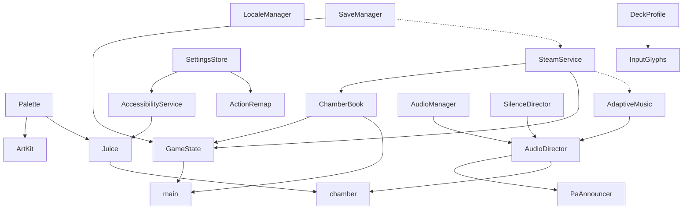

# Echo Lattice — Architecture & Tech-Debt Audit

**Scope:** `cursor/echo-lattice-rc1` @ `03e9a7a` (Cloud-only read of the Godot 4.3 product under `game/echo_lattice/`)  
**Auditor:** Cursor Cloud Agent  
**Date:** 2026-08-09  
**Deliverable:** architecture graph, Godot 4.3 pattern review, test gaps, parallel-PR residue, docs/code drift, release-process risks.

---

## 0. Executive verdict

| Lens | Verdict |
|---|---|
| Runtime architecture | **Coherent enough to ship offline.** Single-scene router (`main.gd`) + 18 autoloads + JSON content book. Not a clean layered engine. |
| Autoload graph | **Wide and order-sensitive.** Core load order is sound (`SaveManager → SteamService → ChamberBook → GameState`); several optional services are half-wired or unused. |
| Godot 4.3 patterns | **Mostly modern GDScript 2.0**, with a few project-config smells and one large gameplay god-object (`chamber.gd` ~1.1k LOC). |
| Test coverage | **Strong static/Python gates; weak runtime/GDScript coverage.** No committed CI; headless `--selftest` exists but is not automated. |
| Parallel-PR residue | **High.** Dozens of open `cursor/echo-lattice-*` / `cursor/release-*` PRs against `main` after packs already landed on RC1; dead M0 meta API; unused daily catalog; design docs pointing at deleted TypeScript paths. |
| Docs / code drift | **Severe in META + juice bible; moderate in RC1/release claims** (Endless, CrashLogHook, Forward+/renderer). |
| Release process risk | **Ship-blocking process gaps**, not gameplay gaps: no `.github` workflows, placeholder AppID, CrashLogHook not autoloaded, compliance/privacy stubs still unchecked. |

**Bottom line:** Treat RC1 as a **playable offline Steam candidate with integration debt**. The biggest risks are (1) merging stale parallel PRs into `main`, (2) shipping docs that describe APIs/modes that do not exist, and (3) releasing without a real export/self-test CI gate.

---

## 1. System map (as shipped on RC1)

```text
project.godot (Godot 4.3, gl_compatibility)
└─ scenes/main.tscn  →  scripts/main.gd   (router)
      Stage child swaps:
        menu.tscn → chamber.tscn → chamber_won.tscn → end_screen.tscn
        + ui/settings_menu.tscn, ui/subtitle_overlay.tscn

Autoloads (boot order) ──► content/ + config/ + audio/ + art/
```

| Layer | Responsibility | Primary files |
|---|---|---|
| Router | Scene swap, `--selftest` / `--screenshot` / Deck layout QA | `scripts/main.gd` (~863 LOC) |
| Run state | Campaign / daily queue, habits, stars, continue | `scripts/game_state.gd` |
| Persistence | Atomic `user://save.json` (+ bak) | `scripts/save_manager.gd` |
| Content | Chamber JSON book, acts, daily wing pick | `scripts/chamber_book.gd`, `content/**` |
| Gameplay | Grid, rewrite ops, softlock recovery, juice hooks | `scripts/chamber.gd` (~1076 LOC) |
| Settings / a11y | Separate settings JSON + remap + flash/colorblind | `scripts/a11y/*` |
| Audio | Event facade over layered music / SFX / PA | `scripts/audio/*` |
| Steam | Offline stub default; optional GodotSteam backend | `scripts/steam/*` |
| Ops (partial) | Local telemetry used; crash hook **not** autoloaded | `local_telemetry.gd`, `ops/crash_log_hook.gd` |

---

## 2. Autoload graph

### 2.1 Declared order (`project.godot`)

| # | Autoload | Script | Boot role |
|---|---|---|---|
| 1 | `LocaleManager` | `locale/locale_manager.gd` | CSV → `TranslationServer`; `user://locale.cfg` |
| 2 | `Palette` | `palette.gd` | Color constants |
| 3 | `ArtKit` | `art_kit.gd` | Texture helpers (uses `Palette`) |
| 4 | `SaveManager` | `save_manager.gd` | Disk I/O; **no `_ready`** |
| 5 | `SteamService` | `steam/steam_service.gd` | Backend select + optional cloud pull |
| 6 | `ChamberBook` | `chamber_book.gd` | Load `acts.json` + chambers |
| 7 | `GameState` | `game_state.gd` | `_ready` → `SaveManager.load_from_disk()` |
| 8 | `SettingsStore` | `a11y/settings_store.gd` | `user://echo_lattice_settings.json` |
| 9 | `AccessibilityService` | `a11y/accessibility_service.gd` | Applies store → runtime |
| 10 | `ActionRemap` | `a11y/action_remap.gd` | InputMap persistence |
| 11 | `Juice` | `juice.gd` | Shake / flash / hitstop (a11y-gated) |
| 12 | `AudioManager` | `audio/audio_manager.gd` | Bus players |
| 13 | `AdaptiveMusic` | `audio/adaptive_music.gd` | L0–L3 layers |
| 14 | `SilenceDirector` | `audio/silence_director.gd` | Early-chamber intensity cap |
| 15 | `PaAnnouncer` | `audio/pa_announcer.gd` | PA lines via AudioDirector/Manager |
| 16 | `AudioDirector` | `audio/audio_director.gd` | Gameplay event facade |
| 17 | `InputGlyphs` | `input_glyphs.gd` | KB/gamepad hint labels |
| 18 | `DeckProfile` | `deck_profile.gd` | Deck detect + FPS/vsync defaults |

**Not autoloaded (residue / optional):** `CrashLogHook` (`project.godot.crash_log.fragment` only).

### 2.2 Dependency edges (runtime)



Solid edges = hard boot or hot-path use. Dotted = optional / feature-flagged.

### 2.3 Order & coupling risks

| Risk | Severity | Detail |
|---|---|---|
| `SteamService` boots before `GameState` / `ChamberBook` finish `_ready` | Medium | Presence/cloud paths use `has_node` guards; still fragile if cloud pull races save load. Documented order in `project.godot.steamworks.fragment` matches project file — keep it. |
| `InputGlyphs` before `DeckProfile` | Low | `_ready` on glyphs does not touch Deck; Deck sets glyph device later via `has_node`. Safe today; reverse order would be clearer. |
| `AdaptiveMusic` before `SilenceDirector` | Low | Music `_ready` does not call Silence; Silence pushes caps later. Order comment in audio fragment is slightly misleading vs real graph. |
| Defensive `has_node("/root/…")` everywhere | Medium debt | Gameplay/audio/menu treat autoloads as optional even though they are mandatory in `project.godot`. Hides misconfiguration; good for partial test harnesses, bad for fail-fast. |
| Triple persistence | High debt | Progress (`save.json`), a11y/audio/input (`echo_lattice_settings.json`), locale (`locale.cfg`). Steam Cloud only knows about `save.json`. |
| Autoload count (18) | Medium | Fine for Godot indie scale; hard for agents to extend without fragment/doc drift. |

### 2.4 Fragment residue

| Fragment | Status vs live `project.godot` |
|---|---|
| `project.godot.audio.fragment` | Merged (buses + 5 audio autoloads present) |
| `project.godot.steamworks.fragment` | Merged (SaveManager/Steam/ChamberBook/GameState present) |
| `project.godot.crash_log.fragment` | **Not merged** — `CrashLogHook` absent from live autoloads |

Fragments that stay after merge become a second source of truth. Prefer deleting merged fragments or marking them `MERGED — do not re-apply`.

---

## 3. Godot 4.3 patterns

### 3.1 What the project does well

- **GDScript 2.0 typing** on public methods (`-> void`, `PackedStringArray`, typed params).
- **Modern I/O:** `FileAccess` / `DirAccess` / `JSON.parse_string` (no Godot 3 `File.new()`).
- **Unique-name nodes** (`%ContinueButton`, etc.) + `@onready` in UI scripts.
- **`class_name` for pure helpers** (`ChamberLoader`, `BalanceTuning`, `SteamBackend`, `FlashGate`, …) instead of more autoloads.
- **Offline-first Steam facade** with stub backend + feature flags (`config/steam_features.json`).
- **Headless-aware Deck/display path** (`DisplayServer.get_name() == "headless"`).
- **Atomic save** via tmp + rename + bak recovery (`SaveManager`).
- **Compatibility renderer** for Deck (`gl_compatibility`) — correct ship choice.

### 3.2 Pattern / tech-debt findings

| ID | Finding | Severity | Recommendation |
|---|---|---|---|
| G43-1 | `config/features` advertises `"Forward Plus"` while `rendering_method=gl_compatibility` | Low (confusing) | Align features string with Compatibility, or document intentional editor default mismatch. Vertical-slice README already contradicts itself on this. |
| G43-2 | `chamber.gd` is a ~1076-LOC god-object (sim, draw, input, audio, softlock, a11y) | High | Split: grid/sim, view/`_draw`, rewrite pipeline, presenters. Keep JSON loader separate (already is). |
| G43-3 | `main.gd` mixes router + selftest + screenshot automation (~863 LOC) | Medium | Move harnesses to `tools/` or `tests/*.gd` SceneTree scripts. |
| G43-4 | Untyped `Array` / `Dictionary` for save + queues | Medium | Prefer `Array[int]` / typed dictionaries at boundaries once save schema is frozen. |
| G43-5 | Autoload access via string `has_node("/root/X")` instead of direct identifier | Low–Med | Use direct autoload names in shipping code; keep string checks only in optional plugins. |
| G43-6 | No `.gdextension` / `addons/` — GodotSteam is compile-time optional via duck typing | OK for RC1 | Document exact GodotSteam pin before flipping `steam_enabled`. |
| G43-7 | `CrashLogHookImpl` `class_name` + commented autoload name mismatch | Low | Either autoload as `CrashLogHook` or rename class; wire or delete fragment. |
| G43-8 | Balance modes `reader` / `cold` exist in JSON + `BalanceTuning` but **no menu/`GameState` mode switch** | Medium | Either ship mode select or mark JSON modes as future; stars always pass `"standard"`. |
| G43-9 | Hard-variant chambers (35–38) load in book but no first-class NG+/hard run entry | Medium | Content residue from content-v2; needs UX or exclusion from campaign counts messaging. |

### 3.3 Content architecture

- **39** chamber JSON files; campaign order **35** ids (`00`–`34`); **4** hard variants.
- Schema/format `2` in `content/acts.json`.
- Grammar/schema dirs present under `content/` — good for validation (`tests/validate_chambers.py`).
- Demo filter via `DemoBuild` + export feature `demo` on **Windows Demo** preset.

---

## 4. Test coverage gaps

### 4.1 What exists (and passes without Godot)

| Suite | Role | Approx. depth |
|---|---|---|
| `validate_chambers.py` | JSON solvability / transform sim | Strong content gate |
| `test_rc_polish.py` | Softlock, rewrite lock, continue, save shape (Python mirror) | Strong for polish semantics |
| `test_balance_v2.py` | Schema + archetype math mirrored in Python | Medium |
| `test_a11y_settings.py` | Defaults JSON + **source-string** presence | Shallow runtime |
| `test_steamworks.py` | Files/docs/flags surface | Shallow |
| `test_demo_spec.py` | Act I allow-list + preset | Medium |
| `test_release_liveops.py` | Docs + stub presence | Shallow |
| `validate_locale.py` | Key parity EN/zh_Hans | Strong l10n gate |
| `check_deck_bindings.py` | InputMap / stretch / Deck autoloads | Medium static |

All of the above were executed green in this audit environment.

### 4.2 Runtime harness (Godot required)

`main.gd -- --selftest` covers: chamber book shape, rewrite involutions, GameState habits/stars, daily wing size, save/bak recovery, continue skip, a11y end-to-end, one live chamber move. This is the **best** behavioral test in the repo — and it is **not** wired into any committed workflow.

### 4.3 Gaps (prioritized)

| Gap | Why it matters | Suggested gate |
|---|---|---|
| No `.github/workflows` | CI_BUILDS.md is a sketch only | Add validate job: chamber validate + locale + polish + `godot --selftest` |
| No GDScript unit tests in tree | PR #49 promised `tests/*.gd`; RC1 has Python only | Port critical selftest slices to `-s` scripts **or** drop the claim |
| `DailyCalendar` / `DailySeeds` untested & unused | Docs/live-ops assume calendar path | Wire into `GameState.start_daily_run` **or** delete + rewrite POSTLAUNCH |
| `reader` / `cold` / Endless untested in runtime | Balance JSON implies modes | Menu + `GameState.run_mode` contract tests |
| Steam cloud merge / conflict | Cloud pull can race local save | Headless stub test for pull-if-newer |
| Crash log hook | Documented for post-launch | Autoload + selftest write path |
| Export smoke | Presets exist; never CI-exported here | Linux export artifact job |
| Localization in scenes | Scripts call `tr()`; no golden screenshot/l10n runtime | Optional zh_Hans boot selftest |
| Performance / Deck FPS | Deck docs claim 60 FPS @ 7W | Manual / device job only — mark as non-CI |

---

## 5. Conflicting parallel-PR residue

### 5.1 Integration reality

RC1 (`docs/RELEASE/RC1_README.md`) lists release packs **#63–#74 merged into RC1**. Those same PRs are still **OPEN against `main`**. That is intentional for the “do not merge RC1 to main” policy — but it creates agent confusion: open PRs look unmerged while their code already lives on RC1.

### 5.2 Stale / conflicting feature PRs still open

These target older bases or features that diverge from RC1 reality:

| PR / branch | Conflict with RC1 |
|---|---|
| #57 `echo-lattice-meta-v2` | Alternate meta (Museum, streaks, NG+) vs current `SaveManager`/`GameState` |
| #59 `echo-lattice-onboard-modes-v2` | Promises **Endless**; RC1 code only has `standard` / `daily` |
| #49 `echo-lattice-qa` | Claims 42 GDScript tests under `tests/` — not present on RC1 |
| #54 `echo-lattice-audio-v2` | Audio already merged; re-merge risk via fragment |
| #56 `echo-lattice-juice-v2` / #46 juice | Design docs still cite TypeScript `src/**` paths that do not exist |
| #60 `systems-v2`, #51 systems doc | Design-only or partial; may fight `chamber.gd` ops set |
| #61 content-v2 → `playable` base | Content already on RC1; wrong base for new work |
| Pre-v2 playable branches (`core-move`, `habit-engine`, `ui`, `tutorial`, …) | Historical; must not merge to `main` |

### 5.3 In-tree residue (not just remote branches)

| Residue | Evidence |
|---|---|
| Obsolete M0 meta contract | `docs/ECHO_LATTICE_META.md` describes `SaveService` / `GameSession` / `game/tests` / `scenes/meta` — **none exist** |
| Dead daily catalog path | `DailyCalendar` + `DailySeeds` + `content/daily/*` unused by `GameState._today_seed()` (YYYYMMDD int) |
| Juice bible → TS prototype | `docs/ECHO_LATTICE/07_JUICE.md` links `game/echo_lattice/src/**/*.ts` (missing) |
| Dual achievement catalogs | `docs/RELEASE/ACHIEVEMENTS.json` ≡ `config/achievements_steam.json` (identical today — drift bomb) |
| Merged autoload fragments kept | Audio/Steam fragments duplicate live config |
| Placeholder AppID / wishlist | `YOUR_APP_ID`, Spacewar `480` noted — correct for prep, unsafe if flags flipped early |
| README title `sandpile-tycoon` | Workspace branding drift vs Echo Lattice product |

### 5.4 Residue policy (recommended)

1. Label open non-RC1 Echo PRs **`superseded-by-rc1`** or close with pointer to RC1.
2. Ban merges from `cursor/echo-lattice-*` feature branches into `main` without an RC1 cherry-pick review.
3. Delete or archive merged `project.godot.*.fragment` files after stamping MERGED.
4. Rewrite or tombstone `ECHO_LATTICE_META.md` (replace with current `SaveManager`/`GameState` contract).

---

## 6. Docs / code drift

| Doc claim | Code reality | Severity |
|---|---|---|
| `ECHO_LATTICE_META.md`: M0 meta shell, `SaveService`, `GameSession`, `ec_01_boot` roster | Playable v2 book, `SaveManager` + `GameState`, chamber slugs `00_quiet_span`… | **Critical** |
| `RC1_README.md`: “Campaign / Daily / **Endless**” | `run_mode` ∈ {`standard`,`daily`} only | **High** |
| `RC1_README` / `CRASH_LOG_HOOK.md`: crash logs local via hook | Script exists; **not autoloaded**; no boot wiring | **High** |
| `POSTLAUNCH.md`: `DailyCalendar.pick_for_date` runtime | Not called from gameplay | **High** |
| `07_JUICE.md`: TypeScript engine paths | Godot `Juice` autoload only | **High** |
| `13_VERTICAL_SLICE_README.md`: Forward+ automatic / GLES3 tree comment vs Compatibility | `gl_compatibility` actually set; features still say Forward Plus | **Medium** |
| `06_AUDIO_BIBLE.md` checklist “wire autoloads” | Already wired on RC1 | **Low** (stale checklist) |
| Balance `reader`/`cold` documented in `14_BALANCE_V2.md` | No player-facing mode select | **Medium** |
| `CI_BUILDS.md`: workflow sketch | No `.github/` in repo | **High** (process) |
| Vertical slice status “0.1.0” / nine-chamber tutorial story | Product is v2 complete (35+ chambers, version `0.2.1`) | **Medium** |

---

## 7. Release process risks

| Risk | Impact | Mitigation |
|---|---|---|
| **No committed CI** | Broken chamber/locale/selftest can ship unnoticed | Land `.github/workflows/validate.yml` from `CI_BUILDS.md` sketch before Steam build |
| **RC1 must not merge to `main`** (policy) | `main` stays empty/planning while Steam builds from RC1 — easy to build wrong ref | Pin SteamPipe/export jobs explicitly to `cursor/echo-lattice-rc1` SHA |
| **Open release PRs vs `main`** | Agents/humans merge #63–#74 into `main` out of order / twice | Close or retarget; single integration branch only |
| **AppID placeholders** | Accidental Spacewar `480` in retail depot | Checklist gate in `STEAMWORKS.md` already; add CI grep deny for `480` in export dir |
| **Steam Cloud off by default** | Good for offline; enabling without merge policy risks save clobber | Keep `cloud_save_enabled: false` until conflict strategy exists |
| **CrashLogHook unwired** | Live-ops runbook assumes local crash bundles | Merge fragment + selftest; keep upload opt-in |
| **Compliance stubs open** | Privacy URL / credits / final audio mix unchecked | Block “Coming Soon” public on C5/C9 from `COMPLIANCE_FINAL.md` |
| **macOS unsigned stub** | Acceptable for RC1 non-goal; dangerous if marketed as Mac ship | Keep store copy Windows/Linux-first |
| **Demo wishlist AppID** | Next Fest demo button may 404 | Replace before demo depot upload |
| **Parallel content authors** | `author_chambers_v2.py` can regenerate JSON out from under playtests | Freeze content SHA for RC1 candidate builds |
| **Audio/art placeholders** | Compliance forbids marketing as final mix | Keep store trailer/ capsuless on final art track |

---

## 8. Priority backlog (architecture only)

### P0 — before any Steam candidate build

1. Commit CI validate: Python suites + `godot --headless -- --selftest`.
2. Tombstone/rewrite `docs/ECHO_LATTICE_META.md`; fix Endless / CrashLogHook / daily-calendar claims.
3. Close or supersede open parallel Echo PRs that are already integrated on RC1.
4. Decide daily seed source of truth: wire `DailyCalendar` **or** delete catalog docs.

### P1 — first post-RC1 eng sprint

5. Split `chamber.gd` / extract selftest from `main.gd`.
6. Wire or remove `CrashLogHook` fragment.
7. Collapse settings persistence (or document Steam Cloud exclusion of settings/locale).
8. Mode story: ship `reader`/`cold`/Endless **or** remove from balance/docs/RC1 copy.
9. Align `config/features` renderer label with `gl_compatibility`.

### P2 — harden

10. Typed save schema + migration tests beyond bak recovery.
11. Single achievements catalog (generate one from the other in CI).
12. Delete merged autoload fragments; add “how to extend autoloads” note to vertical-slice README.
13. GodotSteam pin + depot smoke on a staging AppID.

---

## 9. Appendix — commands run

```bash
# Static suites (no Godot binary required)
python3 game/echo_lattice/tests/validate_chambers.py
python3 game/echo_lattice/tests/test_rc_polish.py
python3 game/echo_lattice/tests/test_balance_v2.py
python3 game/echo_lattice/tests/test_a11y_settings.py
python3 game/echo_lattice/tests/test_steamworks.py
python3 game/echo_lattice/tests/test_demo_spec.py
python3 game/echo_lattice/tests/test_release_liveops.py
python3 game/echo_lattice/tests/validate_locale.py
python3 game/echo_lattice/tests/check_deck_bindings.py

# Runtime (requires Godot 4.3) — not executed in this Cloud audit environment
godot --headless --path game/echo_lattice -- --selftest
```

**Autoload inventory source:** `game/echo_lattice/project.godot` `[autoload]` section.  
**PR census source:** `gh pr list` on 2026-08-09 (release #63–#74 open vs `main`; RC1 #68 open).
