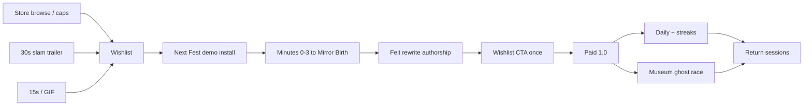

# Echo Lattice — Product Upgrades (Pre-Wishlist / Next Fest / 1.0)

**Audit date:** 2026-08-09  
**Source branch:** `cursor/echo-lattice-rc1` @ `03e9a7a`  
**Playable root:** `game/echo_lattice/` (Godot 4.3)  
**Authority docs:** [`../ECHO_LATTICE/00_OVERVIEW.md`](../ECHO_LATTICE/00_OVERVIEW.md) · [`../ECHO_LATTICE/04_CONTENT_BIBLE.md`](../ECHO_LATTICE/04_CONTENT_BIBLE.md) · [`../ECHO_LATTICE_META.md`](../ECHO_LATTICE_META.md) · META v2 (`15_META_V2.md` on `cursor/echo-lattice-meta-v2`) · [`../RELEASE/`](../RELEASE/)  
**Scope:** What a top indie studio would upgrade before Coming Soon wishlist, Steam Next Fest (Oct 2026), and paid 1.0 — **without diluting the pure fantasy**.  
**Non-goals:** Genre mashups, live-service economy, Act V in 1.0, cosmetic MX, online leaderboards, “AI dungeon” positioning.

---

## 0. Executive verdict

| Question | Answer |
|---|---|
| What is the product fantasy? | A **Field Ledger labyrinth** that fossilizes your last ~30 moves into walls. You escape by rewriting your habits — not by RNG, combat, or loot. |
| Is the fantasy shippable today? | **Loop yes** (menu → chamber → rewrite slam → stars → daily). **Store surface no** (placeholder capsules, placeholder audio, `YOUR_APP_ID` wishlist URL). |
| Biggest pre-fest risk? | Strangers never *see* the slam as the game’s verb — muted first 5s trailer + demo minutes 0–3 decide conversion. |
| Biggest 1.0 retention gap? | **Museum of Selves + ghost race** are specified (META v2) but **not merged into RC1**. Without them, Daily + stars carry return traffic alone. |
| Dilution traps? | Horror stakes, slot/debt loops, roguelike loot, procedural “AI maze,” character customization, battle pass. All out. |

**Bottom line:** Double down on *one verb* (habit → origami rewrite). Spend scarce effort on **store conversion assets**, **demo first-three-minutes**, and **Museum retention** — not new genres or Act V.

---

## 1. Product thesis (locked)

```
Walk → trail → checkpoint → walls become your handwriting → walk differently.
```

| Pillar | Ship claim |
|---|---|
| Verb | Rewrite transforms (`mirror_v/h`, `rotate_180`, `thicken`, compose) on a 24×14 grid |
| Fairness | Deterministic; BFS solvability safety net; undo; stars never gate progression |
| Look | Ink on paper / rust fossilization (Field Ledger) — not glow-on-void |
| Session | Wing / short evening; Daily five-chamber UTC seed; offline |
| Price band | **$4.99–$9.99** (recommended list **$6.99**) |
| Demo | Act I through **Mirror Birth** + Induction identity boss; one wishlist CTA |

**Pure category:** Puzzle (primary) · Minimalist · Singleplayer · Replay Value.  
**Not:** Horror vignette clone, roguelike, idle, coin-pusher, deckbuilder, AI chatbot dungeon.

---

## 2. Market compare (brief, no mash)

| Lens | Echo Lattice | Market note |
|---|---|---|
| **Format** (session, clipability) | Short deterministic puzzle wing; rewrite slam as trailer beat | Same *distribution shape* as breakout short paid vignettes (~$3–$10): one readable system, GIF-able outcome |
| **Category purity** | Puzzle / habit→geometry | Do **not** sell as horror roulette, slot debt, or AI dungeon to chase adjacent heat |
| **Comps to study structure from** | Buckshot-class *length + stakes clarity* (format only); Patrick’s Parabox / Baba-class *systems readability*; peer $5–$8 handmade puzzle shelves | Study pacing and store stills — **do not import mechanics** |
| **Differentiation moat** | Maze is a **transcript of how you walked**; same seed, different walkers, different geometry | Moat dies if store copy leads with “mysterious labyrinth” or “procedural AI” |
| **Threat** | Thin clones of the *look* without the rewrite authorship; or overbuilding into roguelike/meta bloat before slam reads | Stay thin and sharp through Next Fest |

Thesis check: `GAME_PLAN.md` ranked “tension / horror vignette” as Game 1 for ship speed. Echo Lattice **kept the format economics** (short, clip-friendly, $6.99 band) but **resolved into pure puzzle**. That is correct — do not re-mash horror or gambling-feel systems to match the original ranking label.

---

## 3. Current product surface (RC1 reality)

### 3.1 Shipped / integrated

| Layer | State on RC1 |
|---|---|
| Campaign | 35 chambers + 4 hard variants; 4 Acts (Induction→Mastery) |
| Core loop | Rewrite slam, juice, stars vs BFS par, undo, Continue |
| Daily | UTC seed / calendar_90 + catalog fallback; menu Daily button |
| Presentation | Field Ledger VISUAL v2, Steam-hit menu, Deck glyphs path |
| A11y / l10n | Colorblind fossil palette, remap, flash gate, EN + zh-Hans strings |
| Demo gate | `DemoBuild` + Windows Demo preset; Act I allow-list; wishlist button |
| Release ops | Store copy, launch playbook, presskit slots, Steamworks stub, achievements JSON |

### 3.2 Specified elsewhere, thin or missing on RC1

| Layer | Gap |
|---|---|
| META v2 Museum / streaks / weekly / NG+ / short-run hub | On `cursor/echo-lattice-meta-v2` — **not in RC1 tree** (`scripts/meta/` absent). Crash log already expects `museum.selves`. |
| Habit archetype → content bias | Classifier + `RewriteScoreBias` exist; chambers still use **forced** transforms — player rarely *feels* “it countered me” |
| Cross-run ghost race | Assist ghost (a11y once-per-chamber) ≠ Museum self race |
| Audio | Buses + event catalog wired; **placeholder** SFX/music still on disk |
| Store art / trailer | Capsules stamped `PLACEHOLDER`; announce trailer not a final asset |
| Wishlist URL | `YOUR_APP_ID` in `demo_build.gd` |
| Modes | Balance doc Reader / Standard / Cold — menu surface incomplete vs balance contract |

---

## 4. Scoring method

Each upgrade is scored **Impact × Effort** for a small indie shipping before Next Fest / 1.0.

| Score | Impact (wishlist / fest conversion / 1.0 reviews / retention) | Effort |
|---|---|---|
| **5** | Moves the store/demo funnel or review score curve | Multi-week systems / content mountain |
| **4** | Clear conversion or retention lift | Week-class polish or merge of existing branch |
| **3** | Noticeable quality / trust | Few days |
| **2** | Niche / nice-to-have | Day-class |
| **1** | Marginal | Hours |

**I×E** = Impact × Effort inverted for priority: we report **Impact**, **Effort**, and **Priority = Impact ÷ Effort** (higher = do first). Also list raw **I×E product** only as a secondary “bang” when both are high.

Phase tags:

- **W** — before / for Coming Soon wishlist  
- **F** — Next Fest demo window  
- **1** — paid 1.0 gold  
- **P** — post-1.0 (fenced; listed only to stop scope creep)

---

## 5. Ranked upgrade backlog

Sorted by **Priority (Impact ÷ Effort)** descending, then Impact.

### P0 — Do before strangers hit the page / demo

| # | Upgrade | Phase | Imp | Eff | Pri | Why / acceptance |
|---|---|---|---|---|---|---|
| **U01** | **Final capsules + screenshot slate (no PLACEHOLDER stamp)** | W | 5 | 2 | **2.5** | Search/browse CTR is the funnel neck. Briefs exist in [`RELEASE/capsules/`](../RELEASE/capsules/). Accept: stranger names the loop from header alone (“walls are my walk”). |
| **U02** | **30s announce trailer (slam mid-point, muted-safe open)** | W | 5 | 3 | **1.7** | Beat sheet already in [`STEAM_STORE_FINAL.md`](../RELEASE/STEAM_STORE_FINAL.md) §9. Accept: ≥45% watch past first slam; ends on `IT LEARNED YOU` + wishlist. |
| **U03** | **Demo minutes 0–3 teach → Mirror Birth without text wall** | F | 5 | 3 | **1.7** | Fest conversion lives here. Quiet Span → Echo Plate → **Mirror Birth** must fire the “I did that” beat. Accept: cold player clears to Mirror Birth; slam readable at 1280×800. |
| **U04** | **Wishlist CTA with real AppID + one focused CTA** | W/F | 4 | 1 | **4.0** | Replace `YOUR_APP_ID`; demo end + menu only. Accept: shell_open hits live store; no competing store links. |
| **U05** | **Store copy freeze (primary short + long; AI = No)** | W | 4 | 1 | **4.0** | **Done (docs):** [`STORE_COPY_FREEZE.md`](../RELEASE/STORE_COPY_FREEZE.md) + frozen §§ in [`STEAM_STORE_FINAL.md`](../RELEASE/STEAM_STORE_FINAL.md). Accept: tags/order locked; habits/Daily/Endless; never lead with AI/mystery/loot. |
| **U06** | **Coming Soon page live (ASAP / pre–Aug 31 fest gate)** | W | 5 | 2 | **2.5** | Calendar hard gate in store final §11. Accept: capsules, ≥5 shots, trailer, sysreqs, price band, surveys. |

### P1 — Fest conversion & trust

| # | Upgrade | Phase | Imp | Eff | Pri | Why / acceptance |
|---|---|---|---|---|---|---|
| **U07** | **Replace placeholder audio with operator-identity stingers + silence policy** | F/1 | 4 | 3 | **1.3** | Audio bible is the addiction channel; beeps kill premium feel. Accept: each transform has unique earprint; Induction silence preserved; streamer Music mute leaves SFX/PA. |
| **U08** | **Rewrite slam juice pass on mid/low-end + Deck 16:10** | F | 4 | 2 | **2.0** | Slam is the marketing verb — illegible slam = refund/skip. Accept: crease→lift→slot→rust readable at 30 fps / Deck TDP target. |
| **U09** | **Demo exit survey / soft prompt after wishlist** | F | 3 | 2 | **1.5** | Optional marketing §9.4. Accept: one question max; never blocks quit. |
| **U10** | **15s vertical social cut + GIF seq 01 in screenshot slot #1-adjacent** | W/F | 4 | 2 | **2.0** | Short-form discovery. Accept: slam ≤0:08; Field Ledger only. |
| **U11** | **Friend-code / share string on Daily clear** | F/1 | 3 | 2 | **1.5** | Offline virality without leaderboards (META v2 sharing string). Accept: clipboard paste comparable across players same UTC day. |
| **U12** | **Demo softlock / save / input bugbash (BUGBASH.md green)** | F | 5 | 3 | **1.7** | Fest reviews punish softlocks. Accept: checklist in [`BUGBASH.md`](../RELEASE/BUGBASH.md) cleared on Win10/11 + Deck Proton/native. |

### P2 — Systems depth that deepens the *same* fantasy

| # | Upgrade | Phase | Imp | Eff | Pri | Why / acceptance |
|---|---|---|---|---|---|---|
| **U13** | **Merge META v2: Museum of Selves + ghost race self** | 1 | 5 | 4 | **1.25** | Primary 1.0 retention hook already designed. Accept: clear → archive Self; browse; Race this self overlays chalk path; cap 48; deaths never archive. |
| **U14** | **Streaks (play / daily clear) + milestone achievements wired** | 1 | 4 | 3 | **1.3** | Soft return loop; Steam achievements catalog exists. Accept: streak best survives break; achievements milestone-only (no grind). |
| **U15** | **Make habit archetype *legible* in HUD + clear screen** | 1 | 4 | 2 | **2.0** | “It learned you” must be readable, not only a counter. Accept: archetype title + bias % on win; Museum title uses same strings. |
| **U16** | **Optional habit-counter telegraph (without breaking forced pedagogy)** | 1 | 3 | 3 | **1.0** | Use `RewriteScoreBias` on remix/daily where transforms aren’t strictly teaching. Accept: lessons stay forced; daily/remix can feel personal; solvability net unchanged. |
| **U17** | **Short Run (3-chamber / 8–15 min) from meta hub** | 1 | 4 | 3 | **1.3** | Deck/evening fit; reduces “35 chambers” intimidation. Accept: plan budgets in META v2 §8; campaign remains full book. |
| **U18** | **NG+ tighter window after Act clear (config modifiers)** | 1 | 3 | 3 | **1.0** | Mastery without new content mountain. Accept: unlock after Act I coverage; never required for ending. |
| **U19** | **Identity boss portraits: intended echo signature readability pass** | 1 | 4 | 3 | **1.3** | Content bible boss promise. Accept: Who Walked / Portrait / Calcify / Nameplate leave human-legible fossils on intended solve. |
| **U20** | **Cross-run ghost of *your* best clear (not only assist)** | 1 | 3 | 3 | **1.0** | Star chase + Museum trailer beat (“Race your handwriting”). Accept: optional overlay; never required for clear. |

### P3 — Store conversion polish & 1.0 completeness

| # | Upgrade | Phase | Imp | Eff | Pri | Why / acceptance |
|---|---|---|---|---|---|---|
| **U21** | **Reader / Standard / Cold mode select (balance_v2 presets)** | 1 | 3 | 2 | **1.5** | Widens audience without new chambers. Accept: Reader unlimited undo; Cold tighter; stars slack per JSON. |
| **U22** | **Steam achievements + Cloud optional (offline degrade)** | 1 | 3 | 3 | **1.0** | RC1 policy: Steam optional. Accept: stub path remains playable offline. |
| **U23** | **Hold-to-walk + residual a11y from ACCESSIBILITY.md** | 1 | 3 | 2 | **1.5** | Deck comfort / motor a11y. Accept: toggle persisted; no assist breaks daily fairness claims. |
| **U24** | **zh-Hans store page pass (not just in-game)** | W/1 | 3 | 2 | **1.5** | Regional discovery; in-game l10n already started. Accept: short/long/tags localized; compliance unchanged. |
| **U25** | **Hard-variant + Daily calendar authoring polish (90 days honest)** | 1 | 3 | 3 | **1.0** | Post-campaign longevity. Accept: validators green; no procedural infinite claim on store. |
| **U26** | **Presskit zip + 5 warm creator keys before fest** | F | 4 | 2 | **2.0** | Influencer wave in launch playbook. Accept: factsheet + logos + trailer link; key policy set. |
| **U27** | **Hi-res 1920×1080+ recapture of v2_complete tour** | W | 3 | 2 | **1.5** | Partner preference. Accept: store slate order in STEAM_STORE_FINAL §8. |

### Explicitly defer (P — fence)

| Item | Why defer |
|---|---|
| Act V Afterimage | Roadmap DLC; dilutes 1.0 finish line |
| Museum cosmetics shop | Post-1.0 DLC B; no MX/gacha ever |
| Workshop / editor | Post-1.0; demo/store must not promise |
| Online leaderboards / cloud ghosts | Breaks offline purity; not required for friend-code compare |
| New transform ops (`invert`, etc.) | Content bible non-goal for v2; pedagogy cost high |
| Horror antagonist / combat / inventory | Genre mash — kills pure puzzle shelf |
| Live-service calendar seasons | Rejected in ROADMAP |

---

## 6. Priority matrix (Impact × Effort)

```
Impact ↑
5 │ U01 U06          U02 U03 U12              U13
4 │ U04 U05    U08 U10 U15 U26     U07 U14 U17 U19
3 │            U21 U23 U24 U27     U09 U11 U16 U18 U20 U22 U25
2 │
1 │
  └──────────── 1 ──────── 2 ──────── 3 ──────── 4 ── Effort →
```

**Read order for a top indie lead:**

1. **W-week:** U04 → U05 → U01 → U06 → U02 → U10 → U27  
2. **F-week:** U03 → U08 → U12 → U07 → U26 → U11 → U09  
3. **1.0:** U13 → U15 → U14 → U17 → U19 → U21 → U23 → U16 → U18 → U20 → U22 → U25  

---

## 7. Funnel map (Wishlist → Demo → 1.0)



| Stage | North-star metric ([`LAUNCH_PLAYBOOK.md`](../RELEASE/LAUNCH_PLAYBOOK.md) / milestones) | Product lever |
|---|---|---|
| Coming Soon | Wishlist tiers 100 → 500 → 1.5k | U01–U02, U05–U06, U10 |
| Next Fest | Demo → wishlist ≥15% of unique starters | U03, U04, U07–U08, U12 |
| 1.0 week | Review velocity + “one more chamber” | U13–U15, U17, U19 |
| L+14 | Retention without live-ops | Daily calendar + Museum + soft streaks |

---

## 8. Meta hooks (keep pure)

Allowed meta that **reinforces** the fantasy:

| Hook | Fantasy link | 1.0? |
|---|---|---|
| Stars vs par | Cleaner handwriting | Yes |
| Daily shared seed | Same day, different walkers | Yes (shipped core) |
| Museum of Selves | Archive who you were | **Merge META v2** |
| Ghost race self | Race your handwriting | With Museum |
| Archetype titles | Name the habit | Yes (legibility) |
| NG+ tighter window | Habit pressure, not HP | Optional 1.0 |
| Short Run | Same verb, smaller sitting | Yes |

Forbidden meta (dilution):

- Battle pass / season chambers drip  
- Cosmetic gacha or pay-to-skip  
- Loot / builds / loadouts  
- Online ranked ladders as the retention spine  
- Cross-game promo skins  

---

## 9. Demo funnel checklist (Fest gate)

From [`DEMO_SPEC.md`](../RELEASE/DEMO_SPEC.md) + this audit:

- [ ] Windows Demo export on Win10/11 + Deck  
- [ ] Cold clear Quiet Span → Echo Plate → **Mirror Birth** without tutorial essay  
- [ ] Act I finish → **DEMO COMPLETE** / “You met Mirror Birth…” / focused wishlist  
- [ ] Real AppID in `WISHLIST_URL`  
- [ ] No Reflection/Pressure/Mastery files or spoilers in PCK  
- [ ] `--selftest --demo` + `test_demo_spec.py` green  
- [ ] Audio non-placeholder for footstep / rewrite_warn / rewrite_mirror_v / win  
- [ ] Slam readable; reduce-flash path still teaches  

---

## 10. 1.0 scope fence (do not reopen)

**In:** Acts I–IV, Daily + 90-day calendar, stars, Museum + ghost race, streaks, milestone achievements, local crash packs, EN UI (+ zh-Hans as ready), Windows Steam, offline-first.

**Out:** Act V, Museum cosmetics MX, Workshop, mandatory telemetry, full VO, online ghosts, genre mash systems.

If a launch bug “needs” Act V — it doesn’t. Hotfix inside the fence ([`ROADMAP.md`](../RELEASE/ROADMAP.md)).

---

## 11. Recommended studio sequence (technical order)

1. **Lock store identity** — U05, U01, U02, U06 (wishlist oxygen).  
2. **Gold the demo verb** — U04, U03, U08, U12, U07 (fest oxygen).  
3. **Land META v2 retention** — U13, U14, U15, U17 (1.0 oxygen).  
4. **Deepen same systems** — U16, U19, U20, U21, U18 (mastery without mash).  
5. **Platform trust** — U22, U23, U24, U25, U26.  

Do **not** start Act V, Workshop, or a second genre fantasy until post-fest metrics (demo conversion + wishlists) justify DLC A/B.

---

## 12. Sources consulted

| Path | Use |
|---|---|
| `docs/ECHO_LATTICE/00_OVERVIEW.md`, `04_CONTENT_BIBLE.md`, `05_ART_BIBLE.md`, `06_AUDIO_BIBLE.md`, `07_JUICE.md`, `13_VERTICAL_SLICE_README.md`, `14_BALANCE_V2.md`, `14_VISUAL_V2.md`, `CHANGELOG_V2.md` | Fantasy, content, feel |
| `docs/ECHO_LATTICE_META.md` + `origin/cursor/echo-lattice-meta-v2` `15_META_V2.md` | Meta / Museum contract |
| `docs/RELEASE/*` (DEMO, STORE, LAUNCH, ROADMAP, WISHLIST, RC1) | Funnel + fence |
| `docs/GAME_PLAN.md`, `docs/research/CATEGORY_RANKING.md` | Category purity / comps |
| `game/echo_lattice/` (menu, GameState, DemoBuild, habit/bias, a11y, audio placeholders, capsules) | RC1 truth |

---

## 13. Change log

| Date | Note |
|---|---|
| 2026-08-09 | Initial product upgrades audit — Impact÷Effort ranking for Wishlist / Next Fest / 1.0; pure puzzle fantasy preserved. |
