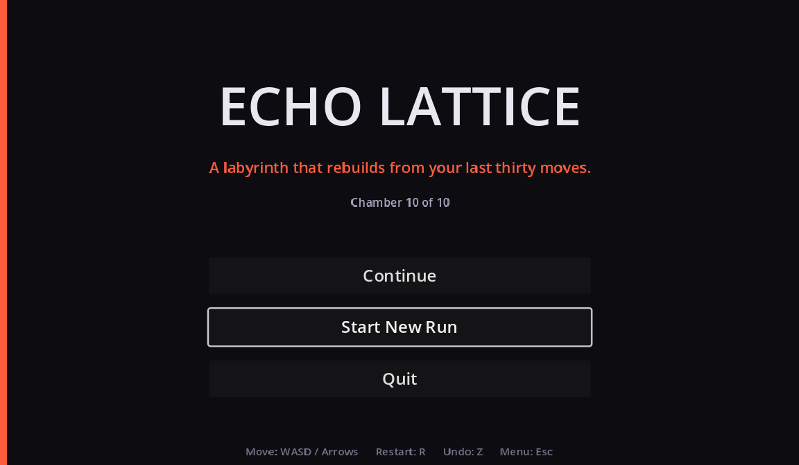
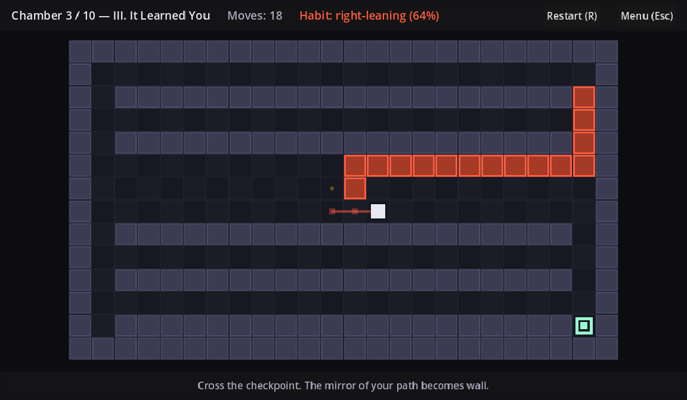
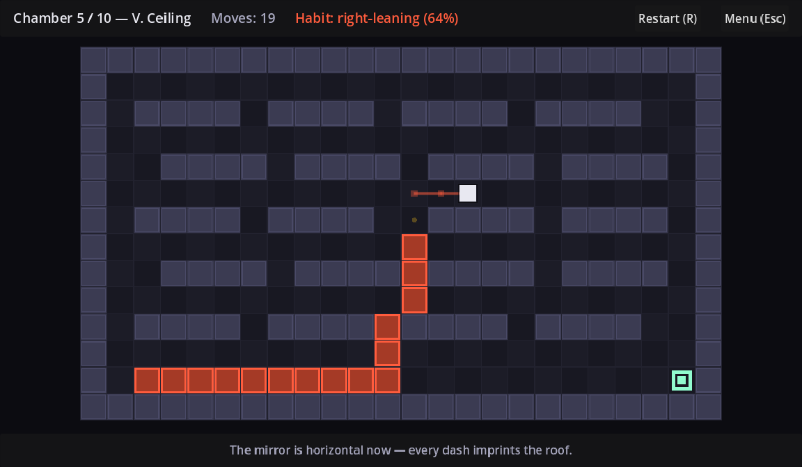
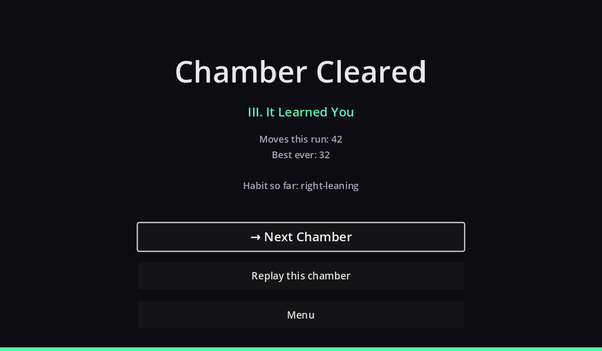
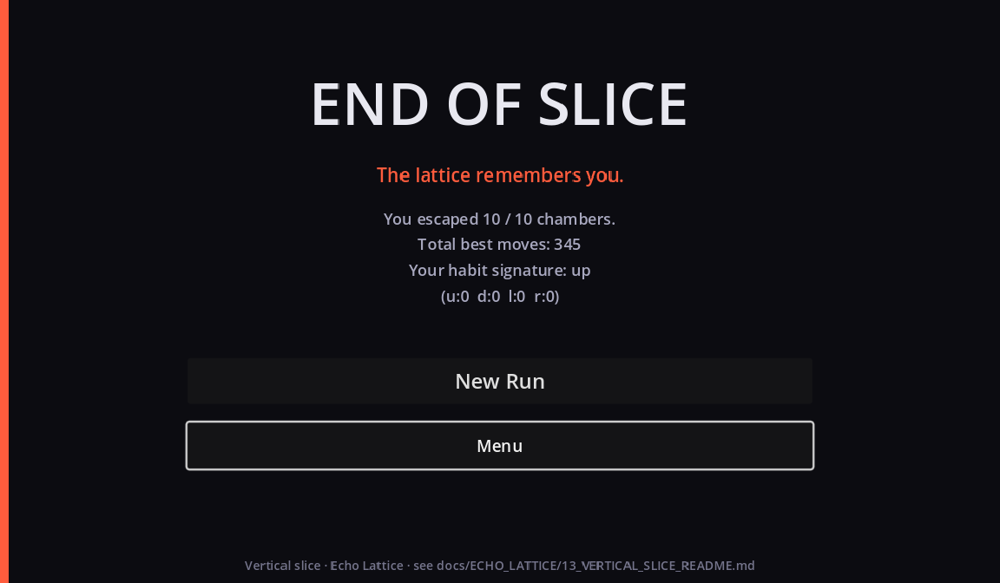

# Echo Lattice — Vertical Slice 0.1.0

**Working title:** Echo Lattice  
**Slice:** `game/echo_lattice/` (Godot 4.3, pure GDScript, single-scene router)  
**Status:** Playable end-to-end — menu → chamber → habits rewrite the maze → goal → chamber-won → next chamber → end-of-slice → restart.  
**JUICE v2:** Screen shake, hitstop-light, footstep→wall birth telegraphs, particles, camera spring — see [`07_JUICE.md`](07_JUICE.md).  
**Design authority:** [`docs/FIVE_GAMES_TO_BUILD.md` — Game 1: Echo Lattice](https://github.com/cmp07/Game-/blob/main/docs/FIVE_GAMES_TO_BUILD.md#game-1) (from PR series).  
**Umbrella PR:** [Echo Lattice playable vertical slice](https://github.com/cmp07/Game-/pulls?q=echo+lattice+playable).

---

## What this slice proves

The pitch from the design bible was:

> *A labyrinth that rebuilds from your last thirty moves — you escape by rewriting your own habits, not by beating RNG.*

This slice delivers the smallest playable version of that pitch that a stranger can pick up:

- The player moves on a **24 × 14 tile grid** with 4 directions + a stripped-down interact model (auto-triggered checkpoints).
- The **first two chambers are silent** — the lattice never rewrites. You are being taught the verb.
- **Chamber III fires the first rewrite.** The mirror of your walked path becomes new orange "echo walls." The tutorial line reads: *"Cross the checkpoint. The mirror of your path becomes wall."*
- From there, chambers layer in three more transforms: `mirror_h` (V. Ceiling), `rotate_180` (VII. Turn), `thicken` (VIII. Thicken), and finally a combined `mirror_v_then_h` (IX. Two Selves).
- A **habit profile** ("right-leaning 64%", etc.) accrues across the whole run so the game visibly "learned you," even between chambers.
- The chamber-won and end-of-slice screens close the loop with best-move tracking and a restart entry point.

Everything is offline, deterministic from input, and drawn without external tile art assets — the whole play surface is generated in `_draw()`, so the on-disk project is small enough to inspect and modify in one sitting.

---

## Screenshots

### Main menu


### Chamber III — right after the first rewrite fires
The player (white square) walked from top-left to the yellow checkpoint. The rewrite mirrored the walked path across the vertical axis, and the orange **echo walls** appeared on the right side of the chamber. The little orange dots to the left of the player are the ghost trail — the last thirty moves.



### Chamber V — horizontal mirror
Same idea, mirrored across the horizontal axis. The path along the top of the maze prints onto the floor.



### Chamber-cleared screen


### End of slice


---

## How to play

### Windows (built binary)

1. Get `EchoLattice.exe` + `EchoLattice.pck` (see "Building" below — the exporter emits them into `game/echo_lattice/builds/windows/`).
2. Keep the two files side by side. Double-click `EchoLattice.exe`.
3. On the menu, choose **Start New Run** (or **Continue** if a save exists at `%APPDATA%\Godot\app_userdata\Echo Lattice\save.json`).

### Linux (built binary)

1. Get `EchoLattice.x86_64` + `EchoLattice.pck` from `game/echo_lattice/builds/linux/`.
2. `chmod +x EchoLattice.x86_64 && ./EchoLattice.x86_64`.
3. Save lives at `~/.local/share/godot/app_userdata/Echo Lattice/save.json`.

### From the Godot editor

1. Install [Godot 4.3](https://godotengine.org/download/archive/4.3-stable/) (Standard, not .NET). The project is single-language GDScript and does not need Mono.
2. In the editor's project manager, **Import** `game/echo_lattice/project.godot`.
3. Press **F5** (Run Project). Main scene is `res://scenes/main.tscn`.
4. `Debug > Run Project` uses the built-in Forward+ renderer path automatically since we ship with `renderer/rendering_method="gl_compatibility"` — no additional configuration is needed.

### Controls

| Action | Keys |
|---|---|
| Move | `WASD` or arrow keys |
| Undo last move | `Z` |
| Restart chamber | `R` |
| Menu | `Esc` |
| Confirm (menus) | `Enter` or `Space` |

Movement is grid-locked and step-based; every keypress is one tile. The undo stack rewinds one move at a time, including reverting an echo-wall rewrite if you undo across a checkpoint.

---

## Building

The project ships with two working export presets (`game/echo_lattice/export_presets.cfg`):

- `Windows Desktop` → `builds/windows/EchoLattice.exe` (x86_64, PCK not embedded)
- `Linux/X11` → `builds/linux/EchoLattice.x86_64` (x86_64, PCK not embedded)

To build headlessly (no editor UI required):

```bash
cd game/echo_lattice
godot --headless --export-release "Windows Desktop" builds/windows/EchoLattice.exe
godot --headless --export-release "Linux/X11"       builds/linux/EchoLattice.x86_64
```

You need the matching Godot 4.3 export templates installed. Install them via the editor (`Editor > Manage Export Templates > Download and Install`) or, if you are automating a CI job, drop the extracted `templates/` folder into:

- Linux/macOS: `~/.local/share/godot/export_templates/4.3.stable/`
- Windows: `%APPDATA%\Godot\export_templates\4.3.stable\`

The templates archive is `Godot_v4.3-stable_export_templates.tpz` from the [Godot 4.3 release page](https://github.com/godotengine/godot-builds/releases/tag/4.3-stable).

We deliberately set `application/modify_resources=false` in the Windows preset so the export does **not** require `rcedit.exe` on the build machine. If you want the produced `.exe` to embed the Windows resource metadata (icon, product name), install rcedit and flip that option back on.

### macOS export (not automated in this slice)

We did not author a macOS preset because signing/notarisation requires developer credentials that are out of scope for a vertical slice. To add one manually:

1. Editor → Project → Export → Add… → macOS.
2. Set `binary_format/architecture = "universal"`.
3. Ship the `.zip` (Godot writes a .app inside).
4. Sign / notarise before distributing.

---

## Verifying without a display

The project has a self-test entry point that runs the same rewrite math, save/load path, and — critically — an **auto-solver that plays every chamber to completion via BFS**, exercising the real Chamber scene with real `_try_move` calls:

```bash
cd game/echo_lattice
godot --headless --path . -- --selftest
# expected: "result: OK" and exit code 0
```

Sample output:

```
== Echo Lattice self-test ==
chambers: 10, grid: 24x14
  chamber 0 'I. First Step' transform=none size=24x14 cps=0
  ...
  chamber 9 'X. Signature' transform=mirror_v size=24x14 cps=2
  playthrough chamber 0 OK
  ...
  playthrough chamber 9 OK
result: OK
```

This has been run against both the editor-driven project and the exported Linux binary in CI-shaped conditions.

---

## Architecture

```
game/echo_lattice/
├── project.godot                # Autoloads, input map, Forward+/GLES3 setup
├── icon.svg                     # Boot / window icon (lattice mark)
├── export_presets.cfg           # Windows Desktop + Linux/X11 presets
├── scenes/
│   ├── main.tscn                # Router — swaps stage children
│   ├── menu.tscn                # Title + Start/Continue/Quit
│   ├── chamber.tscn             # Playable room + HUD + caption bar
│   ├── chamber_won.tscn         # Per-chamber win beat
│   └── end_screen.tscn          # End-of-slice summary + restart
└── scripts/
    ├── main.gd                  # Router + `-- --selftest` + `-- --screenshot`
    ├── menu.gd                  # Menu buttons; emits signals up
    ├── chamber.gd               # Grid, player, rewrites, safety-net BFS,
    │                              full self-drawn renderer (no tile art)
    ├── chamber_scene.gd         # HUD wrapper around Chamber
    ├── chamber_won.gd           # Win-screen data binding
    ├── end_screen.gd            # End-screen data binding
    ├── chamber_book.gd          # Autoload — 10 authored ASCII chambers
    ├── game_state.gd            # Autoload — run state, habit profile, move ring
    └── save_manager.gd          # Autoload — JSON persistence
```

### Rewrite transforms

Each chamber declares a `transform` name in `chamber_book.gd`. When the player steps onto a checkpoint for the first time, the walked path since the last checkpoint is passed through the transform to produce a set of candidate cells, which then become new orange **echo walls**:

| Transform | Chambers using it | What it does |
|---|---|---|
| `none` | I. First Step, II. A Corner | Tutorial silence — no rewrite |
| `mirror_v` | III. It Learned You, IV. Mirrors, VI. Loop, X. Signature | Mirror across the vertical axis |
| `mirror_h` | V. Ceiling | Mirror across the horizontal axis |
| `rotate_180` | VII. Turn | Rotate 180° around chamber centre |
| `thicken` | VIII. Thicken | The walked cells themselves become walls (habit solidifies) |
| `mirror_v_then_h` | IX. Two Selves | Two mirrors in one — a rehearsal for the finale |

Every candidate cell is filtered through a BFS **solvability safety net** in `_would_still_be_reachable` — an echo wall is dropped if placing it would disconnect the player from the goal. This is why you cannot lose the game just by playing sloppily; you can only fail to reach the goal in a given move count. The safety net is what lets the auto-solver clear every chamber every time.

### Save format

`user://save.json`:

```json
{
  "version": 1,
  "current_chamber": 3,
  "best_moves": { "0": 12, "1": 18, "2": 27 },
  "completed":   { "0": true, "1": true, "2": true },
  "habit_profile": { "up": 40, "down": 60, "left": 30, "right": 78 }
}
```

Wipe by deleting the file. There is no cloud sync in this slice.

---

## Known gaps vs. 1.0

The design bible calls for a 15–40 minute session that clears "a wing of 6–10 chambers" and unlocks new transforms across a full run. This slice hits the loop end-to-end but leaves the following pieces intentionally out of scope so we could ship a **working** build first:

| Area | 1.0 target | Vertical slice status |
|---|---|---|
| Chamber count | 12 handmade in MVP, more via editor | **10 handmade chambers** — first two silent, then mirror/rotate/thicken/combined |
| Transform deck | Meta unlock ("mirror, rotate, thicken, invert" as reward drops) | All transforms exist but are **hard-coded per chamber**; no unlock UI, no `invert` |
| Ghost path replay | Ghost of your previous solve visible in-scene | Ghost trail exists **only since the last checkpoint** — no cross-run ghost yet |
| Undo | Present in MVP | ✅ Undo works (stack, reverts across rewrites) |
| Audio | Footstep material pitch-shift + rewrite sting (identity beat) | **No audio yet** — silent build |
| Accessibility | Colorblind lattice palette, hold-to-walk, controller glyphs | Grid tile parity + one accent color (already colorblind-safe); **no controller glyphs**, **no hold-to-walk repeat** |
| Habit profile UI | Full readout (dash-heavy / loopy / hesitant), biases transform packs | **HUD readout only** (`Habit: right-leaning 64%`) — profile does **not** yet bias content |
| Save format | Cloud sync + daily seed history | Local JSON only, no daily seed |
| Steam integration | Achievements, Cloud, Workshop, leaderboards for ghost races | **None** — slice is store-agnostic |
| Level editor / Workshop | Post-MVP goal | **Not present** |
| Localisation | Selected via Steam locale | **English only** |
| Presentation | Optional fake-3D parallax later | **Pure top-down 2D** |
| Trailer / capsule art | Required for wishlist push | **Not authored** — see design bible for trailer beats |

**Not gaps but explicit non-goals for this slice:** LLM/text-gen, online multiplayer, procedurally infinite worlds. The pitch is "one weird verb, deterministically applied" and the slice keeps that promise.

---

## Extending the slice

**Add a new chamber:** append a dict to `ChamberBook.CHAMBERS` in `scripts/chamber_book.gd`. Each map must be a `GRID_H`-tall array of exactly `GRID_W`-wide ASCII strings, with one `P`, one `G`, and one or more `C` tiles if the transform is not `"none"`. The self-test will reject anything malformed.

**Add a new transform:** implement it in `Chamber._apply_transform` in `scripts/chamber.gd`. Return an `Array[Vector2i]` of candidate cells. The safety net will handle solvability filtering automatically.

**Add audio identity:** wire an `AudioStreamPlayer` per material (floor / wall / checkpoint) in `chamber.tscn` and call it from `_try_move`. The design bible's identity beat is footstep pitch-shifting when a rewrite is about to punish a habit — for that, watch the move ring in `GameState` and pitch by the dominant-direction ratio.

**Add a controller preset:** the `move_up|down|left|right`, `undo`, `restart`, `pause_menu`, `confirm` actions in `project.godot` currently only bind keys. Add `InputEventJoypadButton` entries under each action.

---

## Provenance

- Concept and design bible: `docs/FIVE_GAMES_TO_BUILD.md` (Game 1 — Echo Lattice), authored in [PR #16 / `cursor/five-games-deep-dive-93f7`](https://github.com/cmp07/Game-/pulls?q=five+games+deep+dive).
- No prior `echo-lattice-*` branches existed in the repository at slice time; the code in `game/echo_lattice/` is a fresh implementation faithful to the bible's MVP list ("Move buffer, 1 rewrite grammar, 12 handmade chambers, ghost path replay, undo, offline save").
- The safety-net-aware rewrite and BFS auto-solver were added to the slice as production-grade guarantees rather than to the design bible — see `Chamber._would_still_be_reachable` and `Main._sim_playthrough`.
