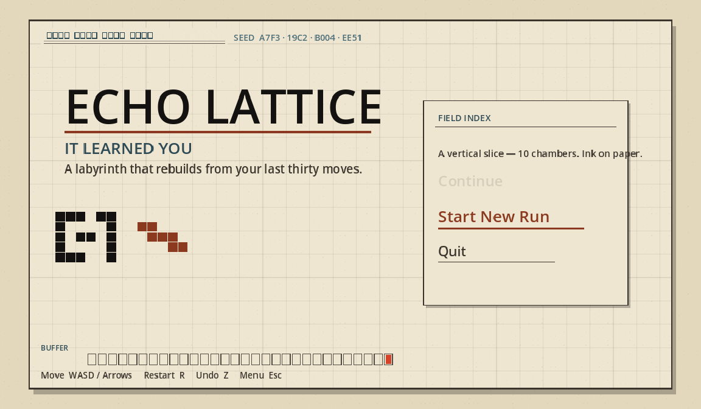
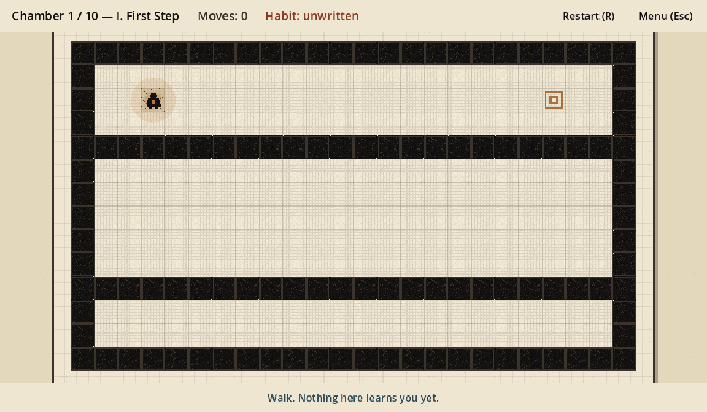
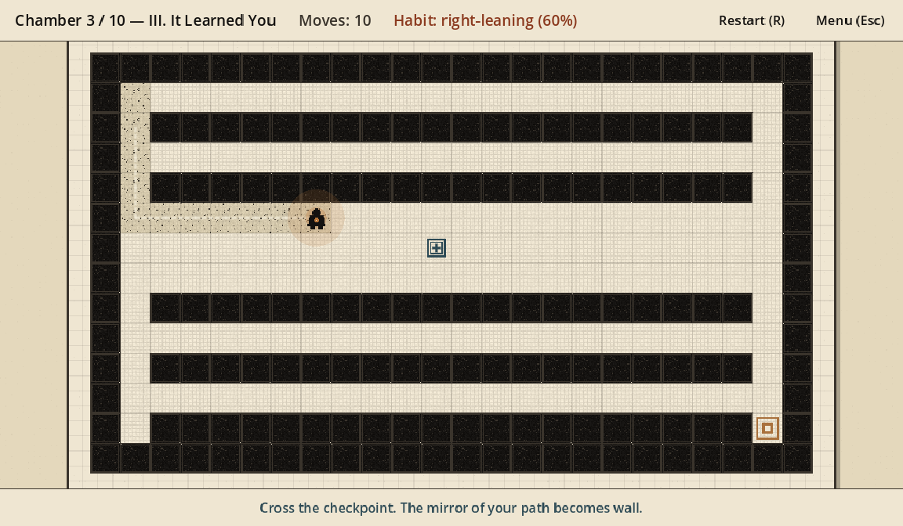
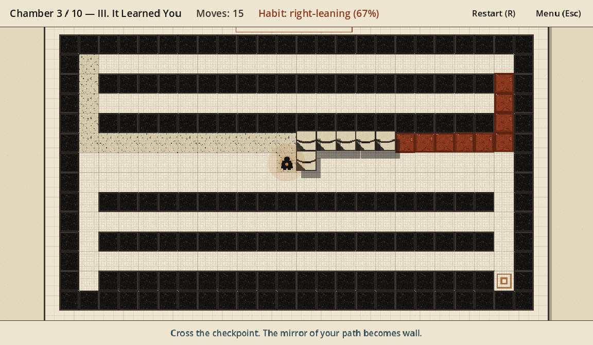
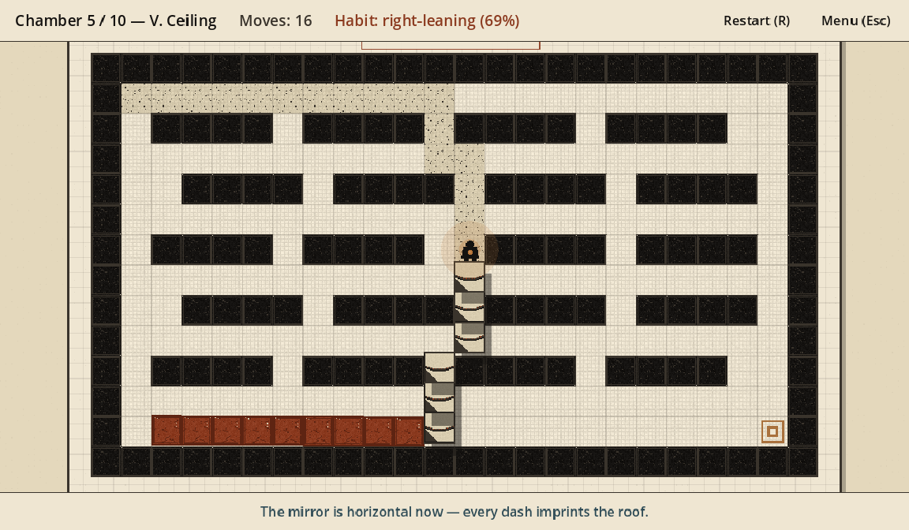
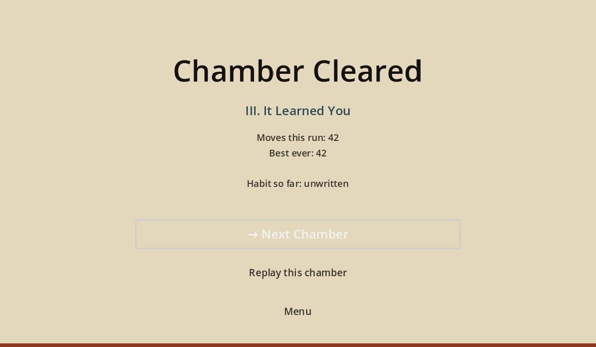
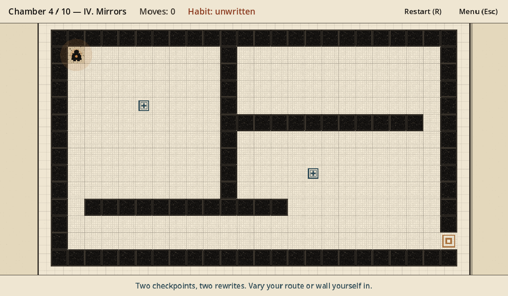

# Echo Lattice — Visual Tour (VISUAL v2)

Seven screenshots from the Godot 4.3 vertical slice after the VISUAL v2 pass.
A stranger can follow the game from title screen to second chamber without
opening the editor.

Images live in `docs/ECHO_LATTICE/screenshots/tour/`. Regenerated via
`game/echo_lattice/tools/capture_tour.sh`.

---

## Art style, in one paragraph

**Ink on paper, not glow on void.** The chamber sits on a warm ledger page
(`paper_bone` `#EFE6D2`) with print grain and a faint sub-grid. Walls are solid
sepia ink (`ink_black`). Floors darken to `paper_deep` under footprints. The
habit accent is **rust fossil** — echo walls harden out of the floor during a
12-beat origami slam (crease → cast-shadow lift → slot → rust bleed), preceded
by a single `cadmium_warn` margin heartbeat. The surveyor is a hooded stamp with
a copper chest lantern. No purple. No bloom. No neon.

---

## 1 — Main menu (Steam-hit title card)



Lightbox ledger. Hero lockup **ECHO LATTICE**, slate tagline **IT LEARNED YOU**,
ambient chalk path + fossil tease, index-card **FIELD INDEX** with underlined
type buttons, seed header, punch-card buffer ribbon.

## 2 — Chamber I, first step



Clean paper corridors, solid ink walls, copper goal plate, surveyor stamp with
lantern disc. HUD reads `Moves: 0` / `Habit: unwritten`.

## 3 — Walking, leaving a trail



Chamber III mid-approach. Dashed chalk ghost trail + footprint stamps on walked
paper. Slate checkpoint stamp ahead. Habit already leaning.

## 4 — Rewrite moment (origami slam)



Frozen mid-slam (`t ≈ 0.55`). Doomed tiles lift with cast shadows and slot into
rust fossil walls in the mirrored shape of the path — the whole verb in one frame.

## 5 — Mid-run, a different transform



Chamber V (`mirror_h`). Same mechanic, different axis — fossil walls print onto
the floor rather than the side.

## 6 — Chamber Cleared



Between-chamber index beat on paper. Moves / best / habit readout.

## 7 — Next chamber — two checkpoints



Chamber IV. Two slate stamps, two rewrites incoming. Caption warns: vary your
route or wall yourself in.

---

## How the screenshots were captured

```bash
sudo apt-get install -y xvfb
# Godot 4.3 stable on PATH as $GODOT
GODOT=/path/to/Godot_v4.3-stable_linux.x86_64 \
  ./game/echo_lattice/tools/capture_tour.sh
```

`rewrite:N` freezes the origami slam mid-fold via `Chamber.freeze_rewrite_at(0.55)`.
