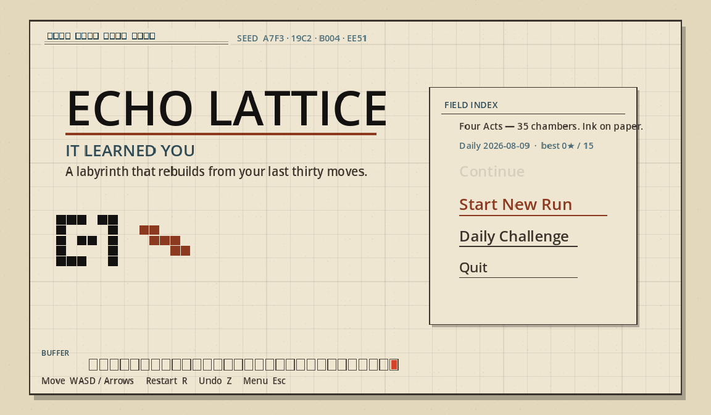
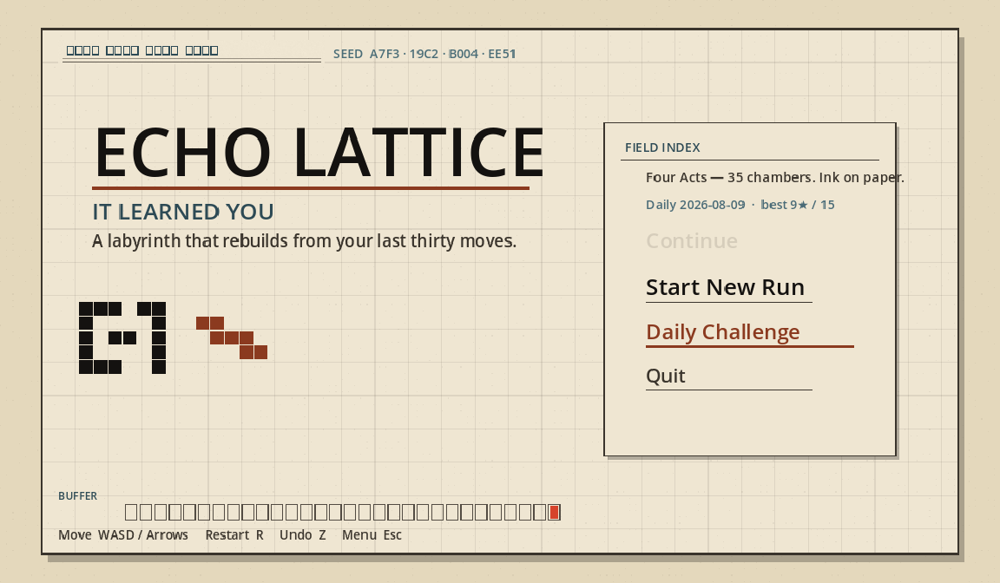
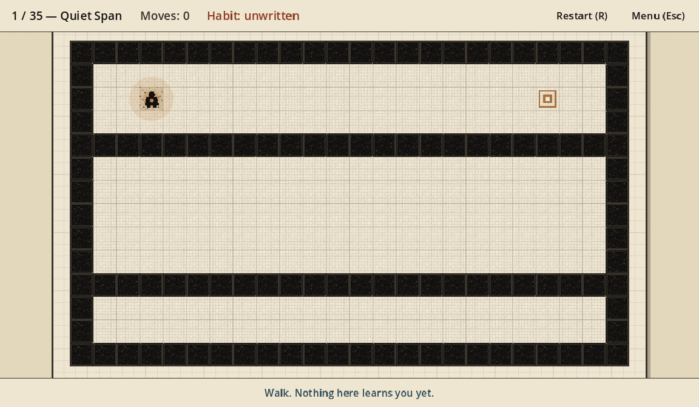
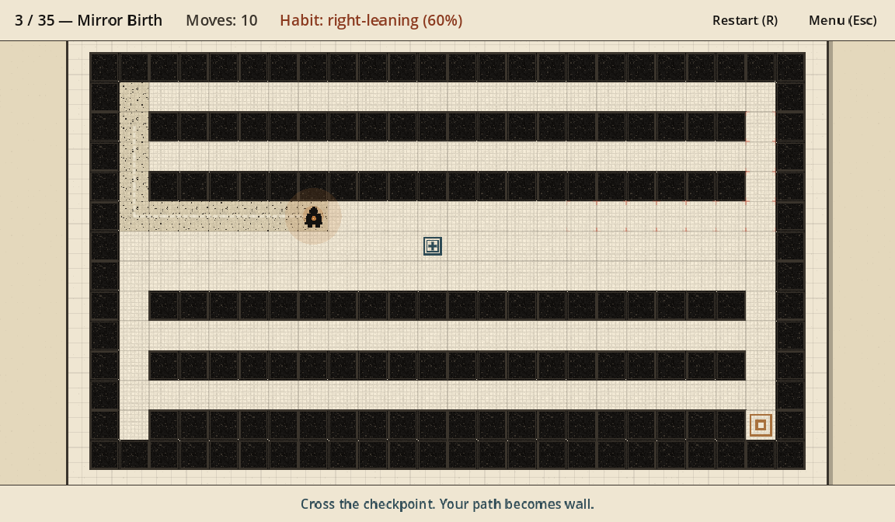
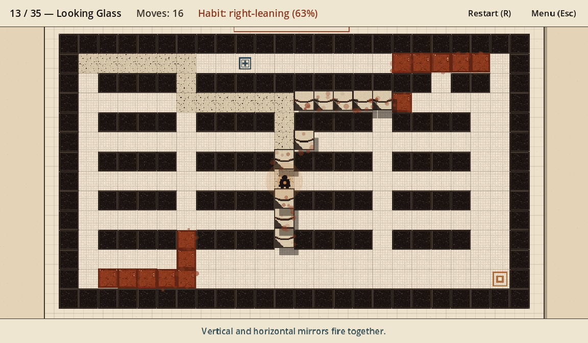
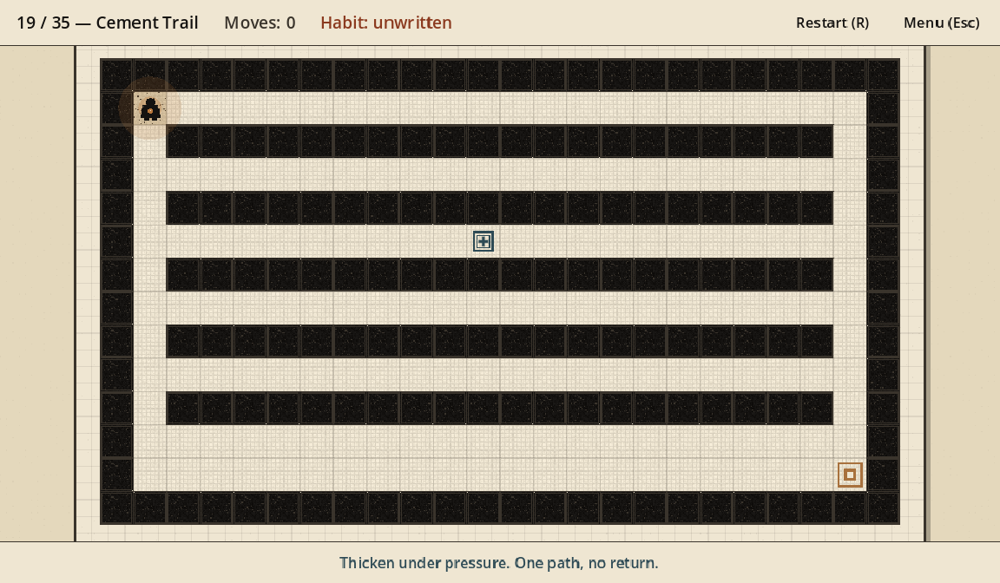
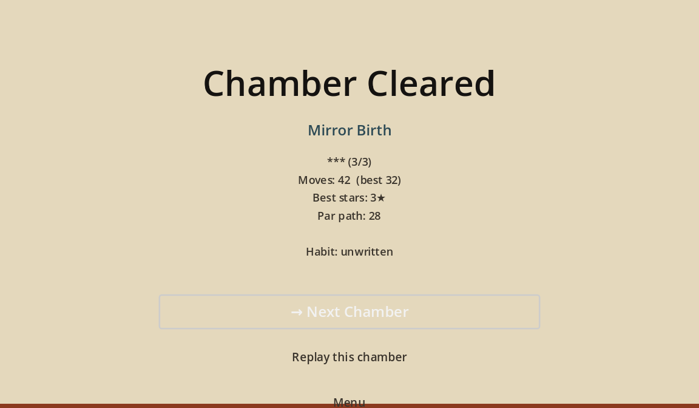
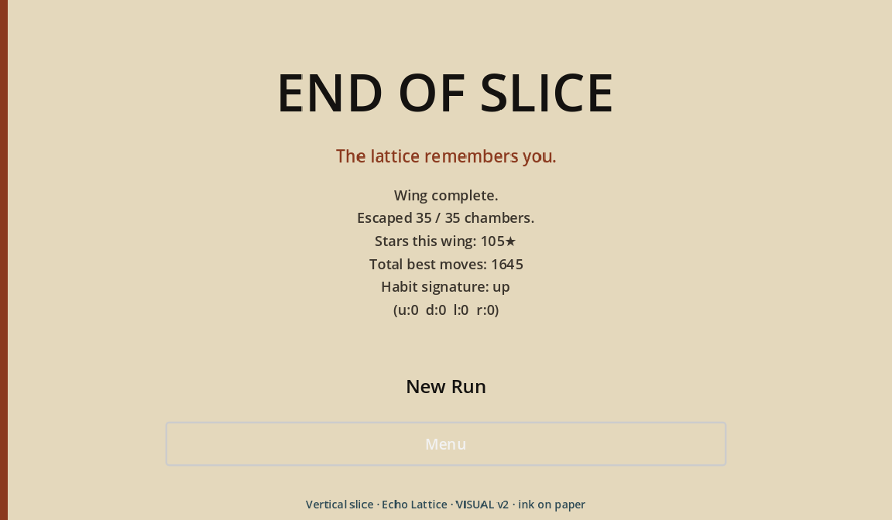

# Echo Lattice v2 complete — visual tour

Plain-language captions for the Godot screenshots in this folder.
Captured with `game/echo_lattice/tools/capture_v2_complete.sh` (xvfb + `--screenshot`).

## 01 — Main menu



Steam-hit Field Ledger title card: paper page, **ECHO LATTICE** lockup, rust underline, ambient chalk path. Field Index reports **Four Acts — 35 chambers**.

## 02 — Daily / mode select



Same ledger menu with **Daily Challenge** in the Field Index (plus today’s seed and best ★ / 15). Start, Continue, Daily, Quit stay one index-card column.

## 03 — Chamber start



Fresh campaign chamber on the ledger page: ink walls, paper floors, surveyor stamp player, copper goal plate. Habit still unwritten.

## 04 — Walking trail / habit forming



Chalk habit trail writing itself toward a checkpoint. No rewrite yet — the lattice is learning the route.

## 05 — Rewrite slam



The spectacular beat: checkpoint fires, origami rewrite slam mid-fold, rust fossil walls landing where the habit mirrored. Cadmium/rust particles and “IT LEARNED YOU” energy without neon purple.

## 06 — Mid / later act chamber



Act III **Cement Trail** (chamber 19 / 35). Same Field Ledger materials deeper in the campaign — thicken under pressure.

## 07 — Win / stars



Clear screen with **1–3★**, moves vs par, habit beat, Next / Replay / Menu. Elevated playable loop, not a content stub.

## 08 — Wing clear



End-of-run ledger: campaign (or daily) complete with total stars and habit signature.

## Regenerate

```bash
export PATH="$HOME/bin:$PATH"   # or GODOT=/path/to/Godot_v4.3
./game/echo_lattice/tools/capture_v2_complete.sh
```
