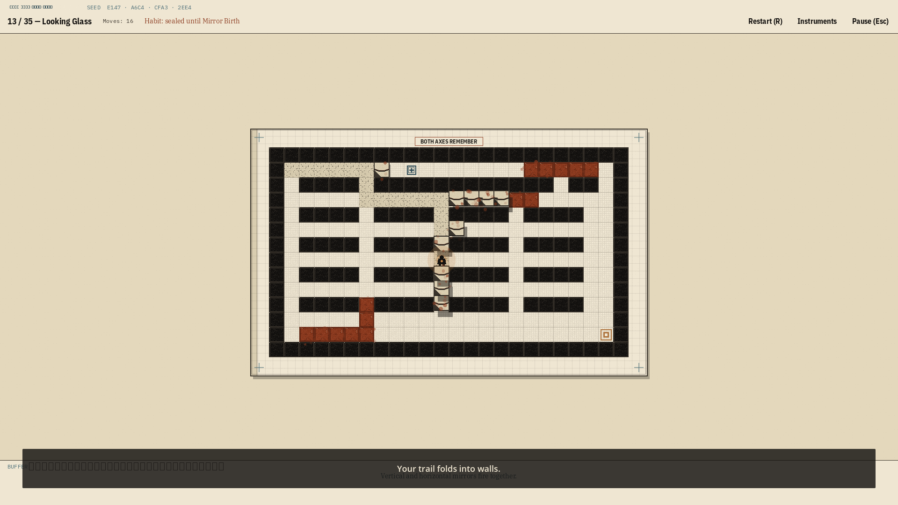
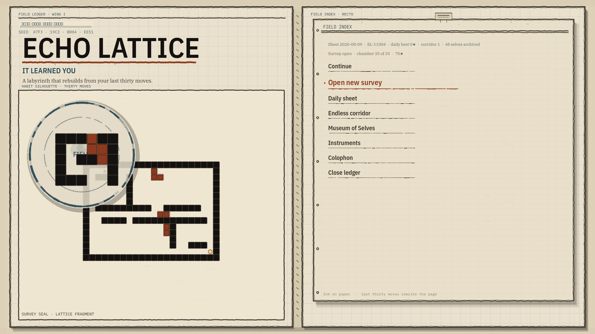
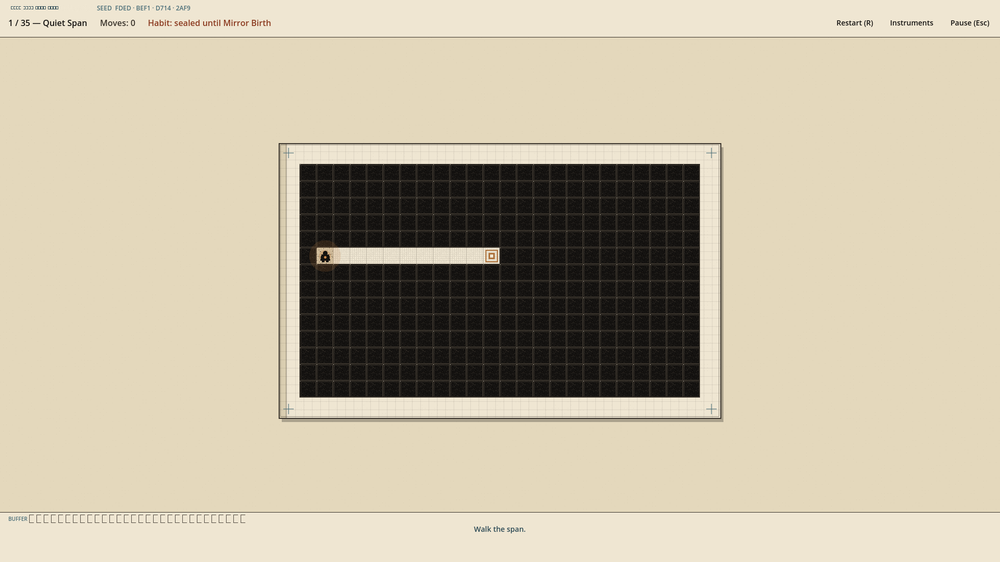
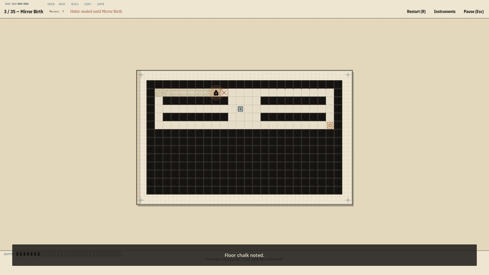
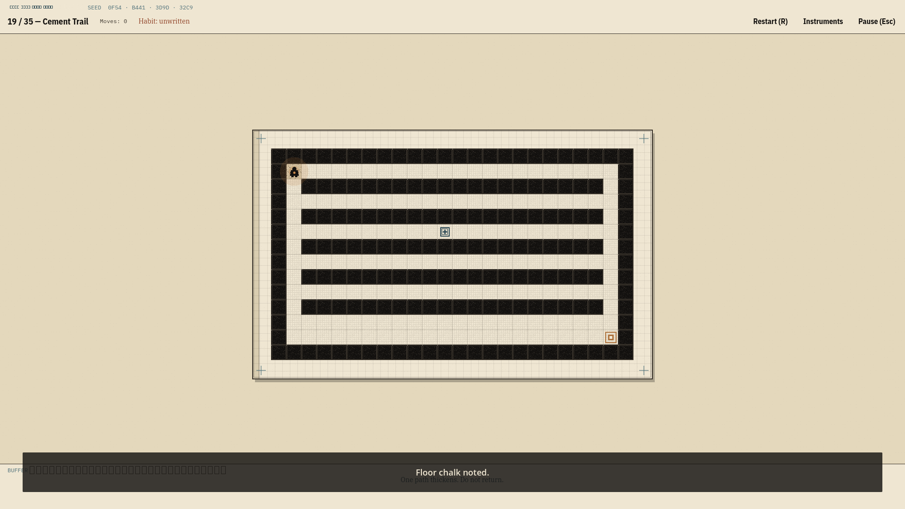
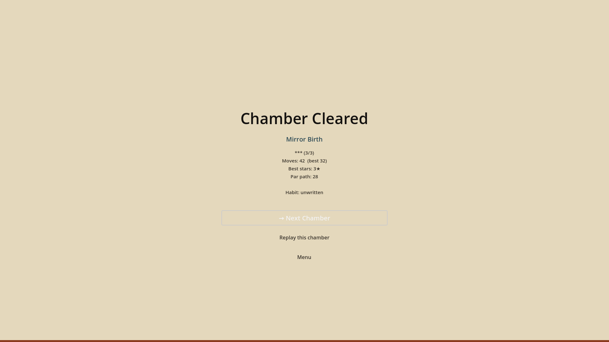
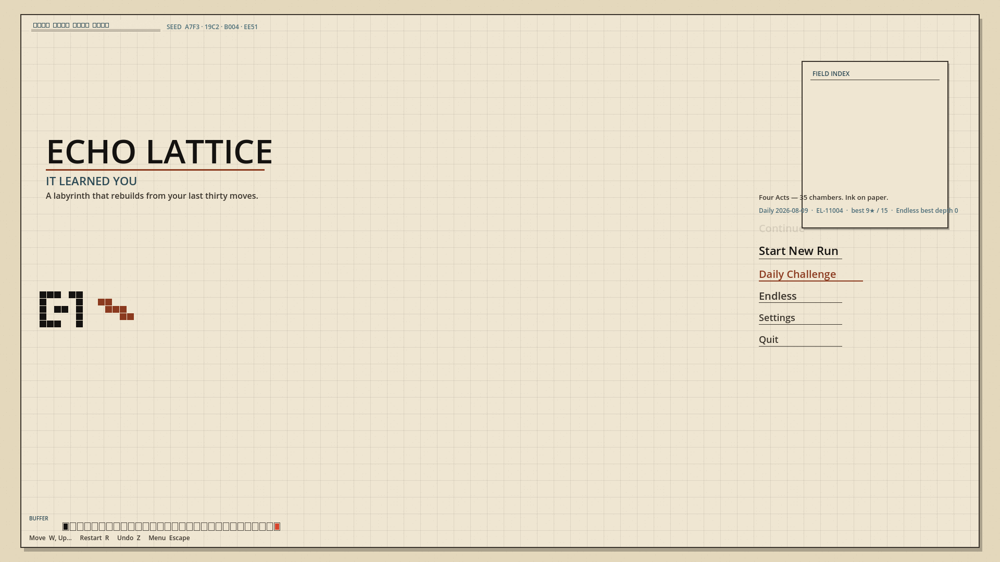
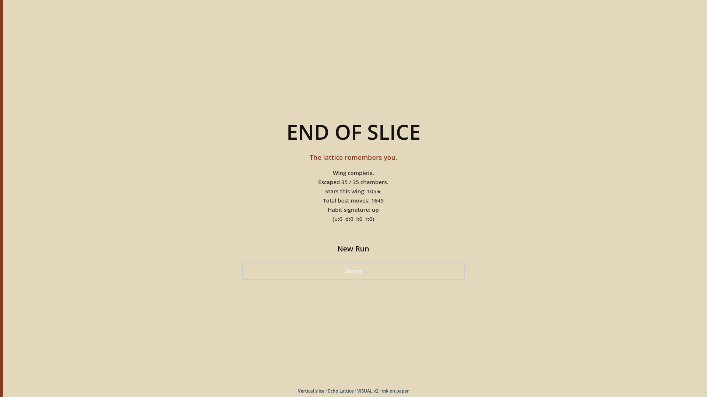

# Steam store slate — captions (1920×1080)

**G1 recapture** from `cursor/execute-g1` @ `26ae974` (RC1 + merged `cursor/g1-*` siblings except parallel `g1-fonts-materials`, which conflicts with execute-g1’s Plex/`ledger_type` pack).  
Tool: `game/echo_lattice/tools/capture_steam_store.sh` (xvfb + `--screenshot` + temporary 1920×1080 `override.cfg`).

Diegetic Field Ledger framing, margin habit print, and clear/end habit beats land in these stills even before G1 merges to RC1 gameplay.

## 01 — Hook / rewrite slam

Looking Glass mid-slam — trail folding into walls; habit still sealed until Mirror Birth. Header / first-slot still.

## 02 — Brand / main menu

Open Field Ledger folio: verso brand + large survey seal stamped on a habit-silhouette maze; recto Field Index (survey / Daily / Endless / Museum / Colophon). Spine kills the dead center void. No chamber BUFFER / Move chrome.

## 03 — Chamber start

Quiet Span clean read: ink walls, copper goal, habit sealed, empty BUFFER strip.

## 04 — Walking trail

Mirror Birth chalk trail writing toward a checkpoint — “Floor chalk noted.” before the slam.

## 05 — Mid-act pressure

Cement Trail under the same ledger margins; habit unwritten, paper plate framing.

## 06 — Win / stars

Clear stamp: 1–3★, moves vs par, **Hand:** line — elevated playable loop without prototype tells.

## 07 — Daily / modes

Daily sheet focused on the Field Index (shared UTC seed).

## 08 — Wing clear

Ledger closed / habit handwriting close — Museum of Selves next.
