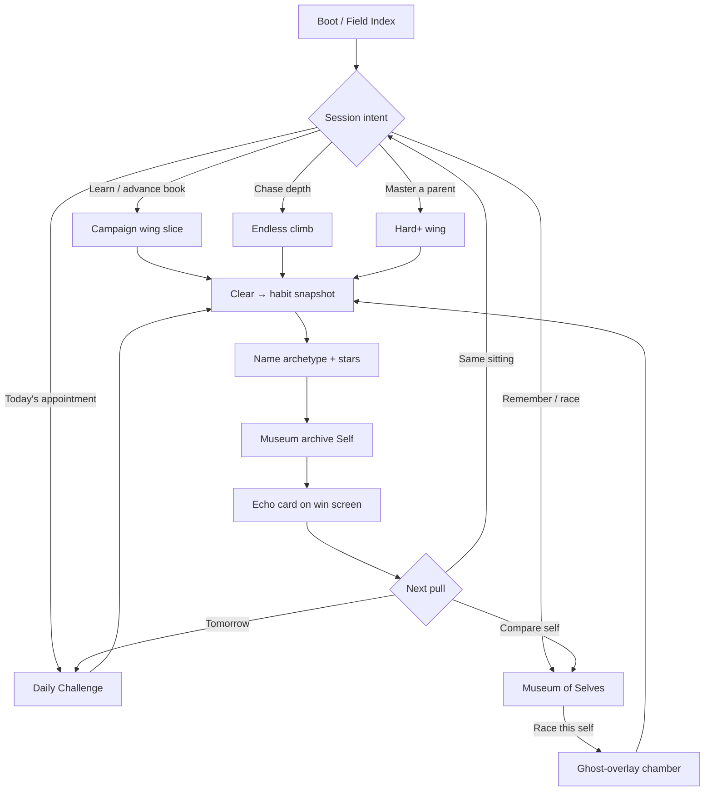

# Echo Lattice — Meta Loops v3

**Document:** `docs/VISION/META_LOOPS_V3.md`  
**Codename:** Echo Lattice  
**Status:** Vision / design contract (CLOUD ONLY — no gameplay code in this PR)  
**Authority for:** How Campaign · Daily · Endless · Museum · Hard+ form **one retention loop** that deepens the habit fantasy  
**Companions:** [`../ECHO_LATTICE/15_META_V2.md`](../ECHO_LATTICE/15_META_V2.md) (on `cursor/echo-lattice-meta-v2`) · thin Museum on RC1 · [`../AUDIT/PRODUCT_UPGRADES.md`](../AUDIT/PRODUCT_UPGRADES.md) · [`../RELEASE/ROADMAP.md`](../RELEASE/ROADMAP.md)

---

## 0. One-sentence thesis

**Every return session should make the player more legible to themselves** — modes are not parallel games; they are stations on a single Habit Ledger loop: *walk → fossilize → name → pressure → archive → race*.

```
Campaign teaches the handwriting.
Daily compares handwriting under a shared seed.
Endless stresses handwriting until it cracks.
Hard+ purifies handwriting against a tighter parent.
Museum keeps the fossils — and lets you race who you were.
```

If a mode does not deepen that sentence, it is out of scope for v3.

---

## 1. Why v2 / RC1 still feel fragmented

RC1 already ships five surfaces. They work, but they do not yet *compose*.

| Surface | RC1 reality | Retention gap |
|---|---|---|
| **Campaign** | 35 chambers / 4 acts, linear Continue | Feels like “the game”; other modes feel like add-ons |
| **Daily** | UTC calendar → 5-chamber wing + friend code | Strong appointment; weakly tied to Museum / archetype |
| **Endless** | Seeded catalog climb; depth raises rewrite pressure | Best-depth chase; no fossil readout or Museum link |
| **Museum** | Thin archive + chalk replay vignette | Browse-only; no race-into-chamber; modes don’t tag meaning |
| **Hard+** | Optional wing of unlocked hard variants | Mastery lane, but menu-parallel — not earned as “cleaner self” |

META v2 specified stars, streaks, weekly, NG+, short-run, Museum ghost race — but as a **feature checklist**, not as a **loop diagram**. Product audit U13–U17 still treat retention as “merge META v2,” which would land systems without a player-facing spine.

**v3 rule:** modes keep their current verbs; we redesign *role, cadence, and feedback* so every clear answers: *who was I, and what did the lattice learn?*

---

## 2. Fantasy lock (do not dilute)

**Product fantasy (locked):** A Field Ledger labyrinth that fossilizes your last ~30 moves into walls. You escape by rewriting habits — not by RNG, combat, or loot.

| Allowed meta | Forbidden meta |
|---|---|
| Stars vs par (cleaner handwriting) | Battle pass / season drip |
| Soft streaks (show up) | Cosmetic gacha / MX |
| Shared UTC seed + offline friend code | Online ranked ladders as spine |
| Museum fossils + optional ghost race | Loot / builds / loadouts |
| Habit archetype titles | Horror antagonist / inventory |
| Pressure from *your* bias | Live-service economy |

Offline-first stays non-negotiable. Steam Cloud / achievements remain optional degrade paths.

---

## 3. The Habit Ledger Loop (retention spine)

### 3.1 Loop diagram



### 3.2 Cadence (player-facing, not live-ops)

| Horizon | Default pull | Success feeling |
|---|---|---|
| **Tonight (8–15 min)** | Short Run: 3 Campaign chambers **or** today’s Daily | “One more wing slice” |
| **Daily appointment** | Daily Challenge (UTC) | Same seed, different walkers; soft streak |
| **Weekly texture** | Optional Weekly seed (META v2) **or** Hard+ focus night | Mastery without FOMO |
| **Lifetime** | Museum plaques + Endless best depth + star ledger | “I can see who I used to be” |

Missing a day zeroes **current** streak only. Best survives. Never gate chambers, endings, or Museum access behind streaks.

---

## 4. Mode roles (one job each)

### 4.1 Campaign — **Curriculum**

| | |
|---|---|
| **Job** | Teach one rewrite idea per chamber; leave identity portraits at act bosses |
| **Session shape** | Short Run (3 chambers) as default Continue; full book remains available |
| **Habit deepening** | Forced pedagogy stays; win screen shows archetype + bias % once classifier has enough steps |
| **Writes to Museum** | Yes on clear (mode tag `standard` / `short_run`) |
| **Reads from Museum** | Optional “ghost of best clear on this chamber” overlay (never required) |

**v3 change vs RC1:** Continue prefers Short Run plans after Act I Mirror Birth so the book doesn’t intimidate; Campaign is no longer the only “real” mode — it is the *teacher*.

### 4.2 Daily — **Appointment + social proof (offline)**

| | |
|---|---|
| **Job** | Shared UTC seed wing; friend-code comparable without servers |
| **Session shape** | 5 chambers (featured calendar chamber + eligible fillers) |
| **Habit deepening** | Featured chamber may use habit-counter transform bias where pedagogy is not forced (`RewriteScoreBias`); win/end card prints archetype lineage for the wing |
| **Writes to Museum** | Yes — at least the featured clear; optionally one “Daily Self” summary plaque per UTC day |
| **Reads from Museum** | End screen can offer “Race yesterday’s Daily Self” if present |

**v3 change vs RC1:** Daily is the **return hook**, not a side button. Main menu hero slot = today’s date · friend code · streak · one CTA. Campaign/Endless/Hard+ sit as secondary Field Index rows.

### 4.3 Endless — **Pressure kiln**

| | |
|---|---|
| **Job** | Raise rewrite pressure until handwriting cracks; chase best depth |
| **Session shape** | Seeded infinite climb; quit anytime; best depth persists |
| **Habit deepening** | Pressure stack should *feel* like counters to the run’s emerging archetype (bias blend rises with depth), not only act-floor + random mirrors |
| **Writes to Museum** | Archive a Self every N clears (config, default every 5) **and** on personal best depth; tag `endless` + depth |
| **Reads from Museum** | At depth milestones, optional chalk overlay of a prior Self with matching archetype |

**v3 change vs RC1:** Endless stops being “another score.” It is where the lattice *pushes back* on the habit you brought from Campaign/Daily.

### 4.4 Hard+ — **Purification**

| | |
|---|---|
| **Job** | Revisit cleared parents under tighter floors/checkpoints/par — cleaner handwriting |
| **Session shape** | Wing of currently unlocked hard variants (parent clear unlocks child) |
| **Habit deepening** | Hard clears compare stars + habit snapshot against the parent Self in Museum (“then vs now”) |
| **Writes to Museum** | Yes; title template prefers purification language (“The Corrected Looper of …”) |
| **Reads from Museum** | Auto-suggest ghost of parent clear when starting a hard variant |

**v3 change vs RC1:** Hard+ is unlocked *and framed* as mastery of a Self, not a hidden difficulty menu. Demo stays Hard+-off.

### 4.5 Museum — **Memory palace (hub, not dump)**

| | |
|---|---|
| **Job** | Hold habit fossils; let the player browse, plaque-read, and **race** a Self |
| **Session shape** | Meta screen; Race launches a single chamber with chalk overlay |
| **Habit deepening** | Filters by archetype / act / mode; plaque shows bias, turns, backtracks, stamp grade |
| **Writes** | Receives from all modes; ring buffer cap 48 (META v2) |
| **Non-goals** | Cosmetics shop, race ladder, MX (DLC B post-1.0 only) |

**v3 change vs thin RC1 Museum:** Race this self must enter a real chamber run (`mode = ghost` + `museum:<id>`), not only a vignette replay. Vignette remains for quick plaque preview.

---

## 5. Cross-mode economy (what flows where)

No currencies. The only “economy” is **legibility**.

| Artifact | Produced by | Consumed by |
|---|---|---|
| **Stars (best 1–3)** | Any clear | Chamber cards, achievements, Museum plaque |
| **Habit snapshot** | Clear (classifier) | Win Echo card, Museum title, Endless bias, Hard+ compare |
| **Self fossil** | Museum archive | Browse, ghost race, Endless milestone overlays |
| **Friend code** | Daily UTC entry | Clipboard share / offline compare |
| **Streaks** | Play / daily clear (soft) | Menu warmth + milestone achievements |
| **Endless depth** | Endless clears | Menu best + optional Museum depth plaque |
| **Hard unlocks** | Parent campaign clear | Hard+ wing membership |

**Progression fence:** Stars, streaks, Museum count, and Endless depth **never** gate Campaign chambers or endings. Hard+ gates only on parent clear (already shipped).

---

## 6. Echo Card — the glue moment

Every clear (all modes) shows a short **Echo Card** before Advance / Menu:

1. Archetype title (same strings as Museum)  
2. Dominant bias % + one plain sentence (“You leaned right.”)  
3. Stars vs par  
4. One contextual CTA:
   - Campaign → Continue Short Run / Museum  
   - Daily → Copy friend code / Race yesterday’s Self  
   - Endless → Keep climbing / Archive depth plaque  
   - Hard+ → Compare to parent Self  
   - Ghost race → “Closer / looser handwriting” delta vs raced Self  

This is the v3 UI contract that makes modes feel like one loop. Without Echo Card, Museum stays a graveyard.

---

## 7. Menu information architecture (Field Index)

First viewport of meta = **one composition**: brand + today’s Daily appointment + primary CTA. Secondary modes are Field Index rows, not a dashboard of equal tiles.

| Priority | Row | Copy intent |
|---|---|---|
| 0 | **Continue / Short Run** | Resume curriculum slice |
| 1 | **Daily Challenge** | Date · `EL-#####` · streak · best ★ |
| 2 | **Museum of Selves** | Count of fossils · “Race a self” |
| 3 | **Endless** | Best depth · last label |
| 4 | **Hard+** | Visible only when ≥1 unlock; “Purify N chambers” |
| 5 | Options / Stats / Quit | Utility |

Campaign New Game remains available but is not the default post-Act-I CTA.

---

## 8. Save / schema deltas (from META v2 → v3)

v3 is a **design layer** on save v2. Prefer additive fields; bump `SAVE_VERSION` only if migration needs a branch.

```jsonc
{
  "version": 3, // or 2 + additive keys via deep-merge
  "loop": {
    "last_mode": "daily",
    "last_echo": {
      "archetype": "right_leaner",
      "bias": 0.62,
      "chamber_id": "02_mirror_birth",
      "stars": 2,
      "self_id": "self_20260809_0012"
    },
    "short_run_pref": true
  },
  "museum": {
    "selves": [/* + mode tags: standard|daily|endless|hard|ghost */],
    "cap": 48,
    "daily_self_by_date": {
      // "2026-08-09": "self_…"  — one summary plaque per UTC day
    }
  },
  "endless": {
    "best_depth": 0,
    "last_label": "",
    "archive_every_n": 5
  },
  "hard": {
    "parent_self_by_chamber": {
      // content_id → museum self_id of best parent clear
    }
  }
}
```

Stars, streaks, seeds, achievements, NG+ remain as in META v2 unless a later impl PR collapses duplicates with RC1 `GameState` fields.

---

## 9. Habit fantasy deepening (systems, still one verb)

v3 does **not** add new transforms. It makes the existing classifier + rewrite bias *legible and mode-aware*.

| Mode | Bias policy |
|---|---|
| Campaign lessons | Forced transforms (pedagogy) |
| Campaign remix / Daily fillers | Optional soft bias (`RewriteScoreBias`) |
| Daily featured | Prefer calendar authoring; soft bias only if `habit_bias: true` in entry |
| Endless | Rising blend toward counters for run’s emerging archetype |
| Hard+ | Authored hard layouts; ghost of parent Self for comparison |
| Ghost race | Overlay only; solvability unchanged |

Acceptance of “deepening”: a cold player can answer, after three sessions, *what habit the game named for them* and *which mode they use to push or purify it*.

---

## 10. Relationship to prior docs

| Doc | Relationship |
|---|---|
| `15_META_V2.md` | Systems catalog (stars, streaks, Museum schema, NG+, short-run). **v3 consumes it** and supplies the loop spine + mode jobs. |
| Thin Museum (RC1) | Keep archive + vignette; **extend** with Race → chamber + Echo Card + filters. |
| `PRODUCT_UPGRADES.md` U13–U17 | Still the impl order; v3 is the design acceptance they must meet. |
| `ROADMAP.md` | Act V / Museum cosmetics remain post-1.0. v3 is 1.0 retention, not DLC. |
| Store freeze | Modes stay Campaign + Daily + Endless; Museum/Hard+ are retention surfaces inside that promise — do not invent a sixth store pillar. |

---

## 11. Non-goals (explicit)

- Weekly battle pass or login calendar rewards  
- Online ghosts / ranked Daily ladders  
- Merging Endless into Daily as one mode  
- Hard+ required for credits  
- New genre systems (combat, inventory, dialogue trees)  
- Procedural infinite campaign claims on the store page  

---

## 12. Implementation map (for a later code PR)

Cloud-only vision lands this doc. A follow-up impl agent should:

1. **Echo Card** on `chamber_won` / end screen (all modes).  
2. **Museum Race** → `GameState` ghost mode + chalk overlay in chamber.  
3. **Menu IA** — Daily appointment hero; Hard+/Endless demoted to Field Index.  
4. **Short Run Continue** planner (META v2 §8).  
5. **Endless habit-pressure blend** + depth archive cadence.  
6. **Hard+ parent Self compare** using Museum links.  
7. Soft streaks + milestone achievements (META v2 / Steam JSON).  
8. Tests: archive rules, ghost fairness, menu gating, save migrate.

Suggested branch family: `cursor/meta-loops-v3-impl-*` against `cursor/echo-lattice-rc1`.

---

## 13. Acceptance matrix (ML3-*)

| ID | Claim |
|---|---|
| **ML3-1** | Each mode has exactly one job (curriculum / appointment / kiln / purification / memory) documented and reflected in menu copy |
| **ML3-2** | Every clear shows an Echo Card with archetype strings shared with Museum |
| **ML3-3** | Museum Race starts a real chamber with optional chalk path; deaths never archive |
| **ML3-4** | Daily remains the primary return appointment; streak soft-break policy unchanged |
| **ML3-5** | Endless archives Self on cadence/PB and can bias pressure toward run archetype |
| **ML3-6** | Hard+ offers parent-Self ghost compare; still optional vs campaign ending |
| **ML3-7** | No mode gates Campaign progression via stars/streaks/Museum count |
| **ML3-8** | Offline: Daily calendar + local Museum + Endless depth work with network disabled |
| **ML3-9** | Store copy still names Campaign / Daily / Endless; Museum & Hard+ described as retention inside that fantasy |
| **ML3-10** | Short Run Continue fits 8–15 minute envelope after Act I teach beat |

---

## 14. Player scripts (north-star sessions)

**First night:** Campaign Short Run through Mirror Birth → Echo Card names a tentative habit → Museum shows first Self → quit warm.

**Second night:** Daily appointment → friend code copy → optional Race of last night’s Self on one chamber → soft streak +1.

**Mastery night:** Hard+ on a loved parent with ghost of old Self → “then vs now” plaque → optional Endless kiln until depth PB archives.

If these three scripts feel like *different games*, v3 failed. If they feel like chapters of the same handwriting, v3 shipped.

---

## 15. Changelog

| Date | Note |
|---|---|
| 2026-08-09 | META_LOOPS_V3 initial vision: Habit Ledger Loop; mode jobs; Echo Card; Museum as hub; schema deltas; ML3 acceptance; CLOUD ONLY. |
