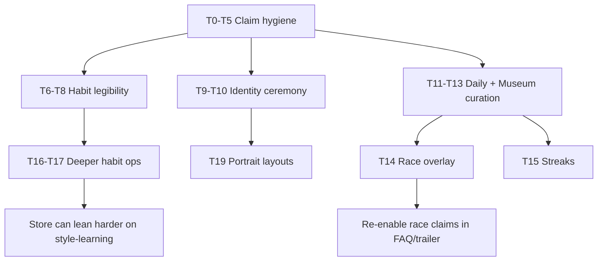

# Echo Lattice — Systems Truth

**Purpose:** After the RC1 wires for **habit**, **daily**, **identity**, and **museum**, state what is *lived* vs still *shallow*, and propose congruence upgrades so marketing claims match play.  
**Lane:** Cloud-only vision / product-truth. No gameplay code in this PR.  
**Tip audited:** `cursor/echo-lattice-rc1` @ `5f0d463` (2026-08-09)  
**Authority wires:** `fix-habit-wire` · `fix-daily-calendar` · `form-identity-ledger` · `upgrade-museum` (+ Endless / Hard+ siblings)  
**Related:** [`../AUDIT/DESIGN_GAMEPLAY.md`](../AUDIT/DESIGN_GAMEPLAY.md) · [`../AUDIT/PRODUCT_UPGRADES.md`](../AUDIT/PRODUCT_UPGRADES.md) · [`../AUDIT/ULTRA_AUDIT_RC1.md`](../AUDIT/ULTRA_AUDIT_RC1.md) · [`../RELEASE/STORE_COPY_FREEZE.md`](../RELEASE/STORE_COPY_FREEZE.md) · [`../RELEASE/STEAM_STORE_FINAL.md`](../RELEASE/STEAM_STORE_FINAL.md)

---

## 0. Verdict

| Layer | Pre-wire (audit debt) | Post-wire lived truth | Still fake / shallow? |
|---|---|---|---|
| **Habit → geometry** | Path mirror only; archetype/bias sidecar | **Partial** — forced transform + **0–2 additive** habit cells (`place_deflector` / `fossilize_hot_cell`) via `HabitRewriteLever` + `RewriteScoreBias` | **Yes — shallow.** Style counters exist; they rarely *feel* like the maze “answered your hand.” Pedagogy still owns the verb. |
| **Daily** | Random 5 / orphaned catalog | **Wired** — UTC `DailyCalendar` → `calendar_90` else catalog hash; friend codes; featured + `daily_eligible` fillers; geometry variation on featured | **Mostly honest.** Palette / hard axes authored but not applied. Wing ≠ “one chamber / day” bible line. |
| **Identity** | Boss = denser `REACH_GOAL` | **Wired** — portrait stamp (symmetry / negative-space / non-thrash); bosses can lift ★; habit HUD sealed until Mirror Birth / Looking Glass | **Partial.** Stamp is real; bosses still clear on reach-goal. Portrait readability in-chamber is thin. |
| **Museum** | META v2 specified, absent | **Thin archive** — clear-only selves (cap 48), plaque + chalk replay vignette, browse screen | **Yes — shallow vs claims.** No ghost **race**. FAQ / ROADMAP / long trailer still sell race / streaks the build does not ship. |

**North star:** Store tagline *It learned you* is true for **path fossilization**. It is only half-true for **style learning**, **portrait authorship**, and **Museum retention**. Congruence work is mostly *felt depth + claim hygiene*, not greenfield systems.

```
Claim honesty today
───────────────────
Path → walls          ████████████████░░  strong (core loop)
Daily shared seed     ███████████████░░░  strong (calendar + code)
Identity stamp        ████████████░░░░░░  medium (score + card; weak pedagogy)
Habit style answer    ████████░░░░░░░░░░  thin (additive cells, quiet UX)
Museum archive        ████████░░░░░░░░░░  thin (browse/replay only)
Museum race / streaks ██░░░░░░░░░░░░░░░░  claim > code
```

---

## 1. Claim map (marketing → lived)

Frozen / public-facing claims vs RC1 tip. Depth: **Lived** · **Thin** · **Claim-only**.

| Claim surface | Claim (paraphrase) | Lived on tip | Depth | Notes |
|---|---|---|---|---|
| Store short / tagline | Habits → walls; *It learned you* | Path buffer → forced transform fossils | **Lived** (path) / **Thin** (style) | Path authorship is the real product. Style bias is additive garnish. |
| Store long | Daily = shared UTC seed, five chambers, offline calendar | Calendar/catalog + friend code + 5-chamber wing | **Lived** | Matches freeze. Do not sell “one chamber” or live-ops feed. |
| Store long | Endless = seeded climb, rewrite pressure, best depth | Thin Endless batch + pressure transforms | **Lived (thin)** | Honest if copy stays “thin climb,” not infinite genre. |
| Store / trailer | Origami slam + chalk trail foreshadow | Telegraph + slam + trail | **Lived** | Keep as hero verb. |
| Trailer long cut | *Race your handwriting* | Assist ghost ≠ Museum race; Museum vignette is replay-only | **Claim-only** | Drop or fence until race ships. |
| FAQ D3 / ROADMAP 1.0 | Museum browse + **ghost-race** prior selves | Browse + replay vignette; tests forbid “Race this self” | **Claim-only** | Highest trust risk in support docs. |
| FAQ B3 / C2 | Daily **streaks** wipe / one recorded attempt | No `daily_streak_*` in `GameState` / save | **Claim-only** | Soften FAQ to “best for today” until streaks land. |
| Content bible | Bosses leave a legible **portrait** | Stamp metrics + card on clear; clear rule still reach-goal | **Thin** | Portrait is scored after the fact, not taught as a solve. |
| Content bible / grammar | Daily variation `palette` + `hard` | `DailyVariation` applies **rotate/reflect only** | **Thin** | Axes exist in JSON; cosmetic/hard unused. |
| Product / META v2 | Habit archetype titles legible on win / Museum | Titles + hand labels post-birth; bias % on Museum detail | **Thin→Lived** | Strings exist; in-chamber “it countered me” still quiet. |
| Balance v2 | Reader / Cold modes; tempo; full counter op set | `active_balance_mode()` → `standard` or `endless` only; propose path = 2 ops | **Claim-only / dead dials** | Delete-or-ship before store mentions modes. |

---

## 2. System audits (post-wire)

### 2.1 Habit — `HabitSignature` → `HabitArchetype` → `RewriteScoreBias` → `HabitRewriteLever`

**What wired (real):**

- Checkpoint commit still applies authored `transform`, then adds habit-selected FLOOR cells that pass BFS.
- Soft/hard gates from `balance_v2` + chamber `soft_hard_bias`; Act I favors soft `place_deflector`; hard `fossilize_hot_cell` unlocks later / Endless floor.
- Telegraph foreshadows habit cells with path echoes.
- Audio can fire a second rewrite event when habit op ≠ transform.
- Habit identity HUD sealed until birth moment (`habit_identity_unlocked`).
- Contract: `tests/test_habit_rewrite_wire.py`.

**What remains shallow:**

| Gap | Why it breaks the thesis |
|---|---|
| Forced transform still owns geometry | Player attributes the slam to “mirror,” not “you looped.” |
| Only two propose ops | Balance lists thicken_walked / carve_shortcut / widen / grow_wall — unused. |
| Max 0–2 habit cells | Easy to miss among path fossils; telegraph does not differentiate style vs path. |
| No win-line “it answered you” | `last_habit_op` / archetype rarely narrated on clear (Museum title is downstream). |
| Reader/Cold not selectable | Mode dials in JSON imply adaptation the menu never exposes. |

**Lived test:** A blind Act II player should say *“it punished my looping / right-lean”* without HUD jargon. **Not yet reliable.**

---

### 2.2 Daily — `DailyCalendar` / `DailySeeds` / `daily_eligible` / friend codes

**What wired (real):**

- `GameState.start_daily_run` → `DailyCalendar.today_utc()` → calendar hit or catalog hash.
- Wing = featured chamber + eligible fillers (lessons like Quiet Span / Mirror Birth stay out of filler pool).
- Friend code on menu meta + HUD; persisted in save.
- Featured chamber applies geometry variation (`rotate` / `reflect`).
- Contract: `tests/test_daily_calendar_wire.py`.

**What remains shallow:**

| Gap | Why it matters |
|---|---|
| Bible “one seeded chamber (+ variation)” vs five-chamber wing | Docs still drift; store correctly says five — keep store, fix bible. |
| `palette` / `hard` variation axes inert | Calendar authors weekend “hard” / palette days that do not change play or look. |
| Open Lattice / `daily_showcase` not special-cased | Epilogue poster chamber is not the daily hero. |
| FAQ streak / single-attempt language | Overclaims retention rules that are not persisted. |

**Lived test:** Two players, same UTC day → same friend code, same featured map+geometry, comparable wing. **Pass.** Feeling that “today was authored” beyond rotate/reflect: **weak.**

---

### 2.3 Identity — `IdentityStamp` + sealed habit HUD

**What wired (real):**

- Identity bosses + Mirror Birth / Looking Glass produce stamp masks + grades (`scribble` / `readable` / `signed`).
- Bosses fold `portrait_stars` into ★ via `merge_stars`; births are ceremony-only.
- Win screen stamp card; save persists `last_identity_stamp` / unlock.
- Contract: `tests/test_identity_stamp.py`.

**What remains shallow:**

| Gap | Why it matters |
|---|---|
| Clear condition unchanged (`REACH_GOAL`) | Boss can be “solved” without composing a portrait; stamp is a report card. |
| In-chamber coaching unused | JSON `hints[]` still not surfaced; no mid-solve silhouette preview. |
| Looking Glass ceremony under-marked | Dual-axis birth shares generic slam language with remixes. |
| Portrait polish | Intentional fossils not layout-guaranteed; softlock net can eat signature walls. |

**Lived test:** Who Walked / Nameplate leave a **visible, route-different** ledger stamp. **Partial pass** (card exists; legibility as boss fantasy incomplete).

---

### 2.4 Museum — thin `MuseumOfSelves`

**What wired (real):**

- Clears archive habit snapshot + compacted ghost path + optional stamp plaque; cap 48; deaths never archive.
- Post-clear caption + chalk vignette; menu → `museum_screen` browse/replay.
- Explicit non-goals in code/tests: no race ladder, no shop, no MX.
- Contract: `tests/test_museum.py`.

**What remains shallow / claim drift:**

| Gap | Why it matters |
|---|---|
| No overlay race in a live chamber | FAQ D3, ROADMAP 1.0 fence, Product U13, trailer “Race your handwriting” oversell. |
| Archive-every-clear noise | Cap 48 fills with remix clears; identity / birth selves are not curated exhibits. |
| Replay ≠ handwriting race energy | Vignette is atmosphere; trailer beat needs in-chamber chalk ghost. |
| Streaks / Short Run / NG+ still absent | META retention spine incomplete; do not sell as shipped. |

**Lived test:** Return player browses a titled self and replays chalk. **Pass (thin).** “Race yesterday’s hand”: **fail.**

---

## 3. Congruence upgrades

Principle: **either deepen the feel to match the claim, or shrink the claim to match the feel.** Prefer deepen for thesis verbs; shrink for support/trailer overreach.

### 3.1 P0 — Stop lying (claim hygiene · hours–day)

| ID | Upgrade | Claim to fix | Acceptance |
|---|---|---|---|
| **T0** | FAQ D3 → “browse + replay chalk vignette”; remove ghost-race until shipped | FAQ / Support | FAQ matches `museum_screen.gd` |
| **T1** | ROADMAP / Product funnel: Museum 1.0 = **archive + replay**; race = named 1.0.1 / free update | ROADMAP, PRODUCT_UPGRADES | No “1.0 ships race” without code |
| **T2** | Trailer long-cut beat: replace *Race your handwriting* with *Keep your handwriting* / Museum plaque still | `STEAM_STORE_FINAL` §9 long | Or ship race before encode |
| **T3** | FAQ C2 / B3: drop daily-streak wipe language; say **best-for-today** + friend code | FAQ | Matches `daily_best_for_today` |
| **T4** | Content bible Daily line → five-chamber UTC wing (featured + eligible) | `04_CONTENT_BIBLE` | Bible ↔ store freeze |
| **T5** | Ultra audit residue: mark thin Museum **present**; race still open | `ULTRA_AUDIT_RC1` | Scorecard not “Museum absent” |

### 3.2 P1 — Make wired systems *felt* (thesis · day–week class)

| ID | Upgrade | System | Acceptance |
|---|---|---|---|
| **T6** | **Habit answer beat** — on commit, one rust PA / subtitle when `last_habit_op` fires (“Corridor sealed.” / “Loop calcified.”) keyed by archetype | Habit | Blind tester names the punishment without opening Museum |
| **T7** | **Split telegraph** — path echoes chalk/slate; habit cells rust outline or punch-card tick | Habit | Streamer can point to “style walls” pre-slam |
| **T8** | Win / Museum use same archetype title strings (`habit.hand_*` ↔ Museum titles) | Habit + Museum | U15 from product backlog, closed |
| **T9** | Identity: pre-goal **silhouette ghost** of current echo mask + grade whisper (readable/scribble) | Identity | Bosses teach portrait before clear |
| **T10** | Looking Glass second-ceremony (unique PA + slam chroma within ledger) | Identity | Dual-axis birth reads as Mirror Birth kin |
| **T11** | Daily: apply `hard` axis (par/tempo or soft_hard floor) **or** strip from calendar JSON | Daily | No inert authored days |
| **T12** | Daily: palette axis tint wing paper **or** remove from variation grammar | Daily | Cosmetic claim becomes visible or dies |
| **T13** | Museum: prefer archiving identity/birth/daily clears into “Exhibits”; demote spam remixes | Museum | Cap 48 feels curated |

### 3.3 P2 — Earn the bigger claims (1.0 retention · week-class)

| ID | Upgrade | Unlocks this claim | Acceptance |
|---|---|---|---|
| **T14** | Optional **Race this self** overlay (chalk path in chamber; never required) | Trailer / FAQ race | Product U13 remainder; offline; no ladder |
| **T15** | Soft daily play/clear streaks + milestone achievements | FAQ streaks | Best survives break; no grind |
| **T16** | Habit soft-choice among legal ops on remix/daily when pedagogy allows | “It learned your style” | Lessons stay forced; solvability net unchanged |
| **T17** | Expand propose set (one more soft + one hard) with unique stingers | Audio/thesis depth | Dead stinger IDs gone |
| **T18** | Reader / Cold menu **or** delete modes from balance/docs | Mode honesty | No orphan JSON |
| **T19** | Identity intended-solve layout pass (Who Walked → Nameplate) | Content bible portraits | Stamp grade ≥ readable on intended route |

### 3.4 Explicit non-upgrades (keep pure)

- Do not reintroduce horror stakes, loot, or generative “AI maze” to sell learning.
- Do not ship Museum cosmetics / MX to fake retention depth.
- Do not replace forced transforms in Act I lessons — teach first, personalize on remix/daily/Endless.

---

## 4. Recommended sequencing



1. **Honesty pass (P0)** before Partner paste / FAQ freeze.  
2. **Feel pass (P1)** so existing wires read as authorship, not sidecars.  
3. **Earn pass (P2)** only for claims you want on the store page long-term.

---

## 5. Acceptance — “marketing = lived”

A build may keep *It learned you* as the lead when **all** are true:

1. **Path** — stranger names the rewrite verb from the first slam (already expected for demo).  
2. **Style** — after Act II, stranger can say the maze punished a *habit*, not only a mirror (T6–T8).  
3. **Daily** — same UTC friend code ⇒ same featured geometry; no FAQ streak fiction (T3, T11).  
4. **Identity** — boss stamp differs by route and is previewed before clear (T9, T19).  
5. **Museum** — every public sentence matches archive+replay **or** race is ship-gated with T14 before copy returns.

Until then: sell **path authorship + Daily + Endless + thin Museum archive**; treat style-learning, portrait bosses, and race as **aspirational** in internal vision — not support-facing fact.

---

## 6. Evidence index

| Topic | Paths |
|---|---|
| Habit wire | `scripts/habit_rewrite_lever.gd`, `habit_signature.gd`, `habit_archetype.gd`, `rewrite_score_bias.gd`, `chamber.gd` (`_select_habit_rewrite_cells`) |
| Habit tests | `tests/test_habit_rewrite_wire.py` |
| Daily wire | `daily_calendar.gd`, `daily_seeds.gd`, `daily_variation.gd`, `game_state.gd` (`start_daily_run`) |
| Daily tests | `tests/test_daily_calendar_wire.py` |
| Identity | `identity_stamp.gd`, `identity_stamp_card.gd`, `chamber_won.gd` |
| Identity tests | `tests/test_identity_stamp.py` |
| Museum | `museum_of_selves.gd`, `museum_screen.gd`, `habit_replay_vignette.gd` |
| Museum tests | `tests/test_museum.py` |
| Store freeze | `docs/RELEASE/STORE_COPY_FREEZE.md`, `STEAM_STORE_FINAL.md` |
| Overclaim surfaces | `SUPPORT_FAQ.md` D3/C2, `ROADMAP.md` §1.0 Museum race, trailer long-cut race line |

---

## 7. Change log

| Date | Note |
|---|---|
| 2026-08-09 | Initial Systems Truth after habit / daily / identity / museum wires on RC1 tip `5f0d463` |

---

*End of vision doc. Cloud-only congruence audit; implementation belongs on follow-up fix/upgrade branches.*
