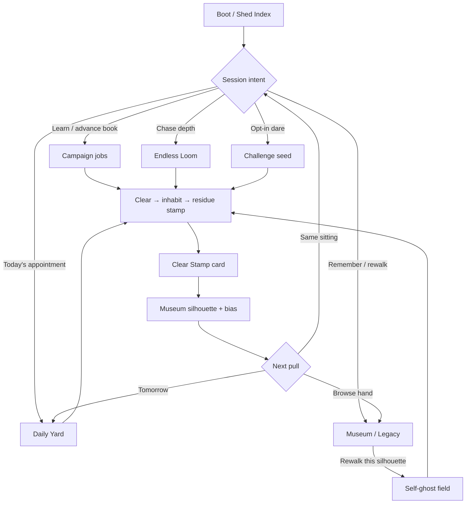

# The Weaver — 1000× Modes (Solo)

**Document:** `docs/WEAVER/1000X/07_MODES.md`  
**Product:** **The Weaver** (north star) · Echo Lattice frozen beside it  
**Status:** Design contract (CLOUD ONLY — no gameplay code in this PR)  
**Branch:** `cursor/weaver-1000x-modes`  
**Base:** `cursor/echo-lattice-rc1`  
**Authority for:** How **Campaign · Daily Yard · Endless Loom · Museum / Legacy gallery · Challenge seeds** form one solo retention loop  
**Peers (when present):** [`00_MASTER_VISION.md`](00_MASTER_VISION.md) · [`01_CORE_LOOP.md`](01_CORE_LOOP.md) · [`05_WORLD.md`](05_WORLD.md) · [`06_PROGRESSION.md`](06_PROGRESSION.md) · [`../MASTER_GDD.md`](../MASTER_GDD.md) · [`../08_LEGACY.md`](../08_LEGACY.md) · [`../28_LEGACY_V2.md`](../28_LEGACY_V2.md) · [`../11_PROGRESSION.md`](../11_PROGRESSION.md) · [`../12_MULTIPLAYER.md`](../12_MULTIPLAYER.md) · [`../17_MVP.md`](../17_MVP.md) · [`../BUILD_ON_LATTICE.md`](../BUILD_ON_LATTICE.md)

---

## 0. One-sentence thesis

**Every return session should make the player more legible to themselves as a craftsperson** — modes are not parallel games; they are stations on one Shed Yard loop: *survey → weave → inhabit → stamp → pressure → archive*.

```
Campaign teaches the hand.
Daily Yard compares hands under a shared seed.
Endless Loom stresses the hand until the cloth frays.
Museum / Legacy keeps the silhouettes — and lets you rewalk who you were.
Challenge seeds are authored dares you opt into — never appointments that punish absence.
```

If a mode does not deepen that sentence, it is out of 1000× scope.

**Hard lock:** **Solo only.** No lobbies, ranked boards, invade ghosts, or always-online appointment world. Social proof = shared seed + local silhouette you can show.

---

## 1. Why modes matter at 1000×

[`17_MVP.md`](../17_MVP.md) rightly cuts meta dump from the vertical slice: one Yard, jobs, gallery thin. Echo Lattice already proved that **Campaign / Daily / Endless / Museum** retain when they share one verb. Weaver must steal that *composition*, not the Field Ledger identity.

| Gap today | 1000× answer |
|---|---|
| Prototype is “Enter the Yard” only | Mode select becomes Shed Index stations with one job each |
| Lattice Archive modes sit beside Weaver CTA | Weaver owns Campaign / Daily / Endless / Museum; Lattice chambers stay archive |
| Legacy is thin stamp + wall ([`08_LEGACY.md`](../08_LEGACY.md)) | Museum is the retention hub that *receives* every mode’s clear |
| Daily / Endless named in multiplayer docs but not mode-owned | This doc locks roles, cadence, and fences |

**1000× is not more genres.** It is one craft verb made undeniable across demo minutes, campaign climax, Daily return, Endless pressure, and Museum pride.

---

## 2. Fantasy lock (do not dilute)

| Allowed mode meta | Forbidden mode meta |
|---|---|
| Authored Yard jobs & short runs | Battle pass / season drip / energy meters |
| Soft Daily streak (show up) | Cosmetic gacha / pay-to-skip |
| Shared UTC seed + offline friend/seed code | Online ranked ladders as spine |
| Local Museum silhouettes + optional self-ghost rewalk | Server monuments / housing districts |
| Thread-economy stars / elegance | Loot power from old Structures |
| Challenge seed catalog (opt-in) | Live-service FOMO that gates campaign |
| Residue bias pedagogy | Always-online evolution ticks that punish absence |

**Player line:** *“Same loom, different weave.”*  
**Offline bar:** Full Campaign + Daily + Endless + Museum with Steam disabled and network killed ([`MASTER_GDD.md`](../MASTER_GDD.md) pillar 5).

---

## 3. The Shed Yard Loop (retention spine)

### 3.1 Loop diagram



### 3.2 Cadence (player-facing, not live-ops)

| Horizon | Default pull | Success feeling |
|---|---|---|
| **Tonight (8–20 min)** | Short Run: 2–3 Campaign jobs **or** today’s Daily Yard | “One more contract” |
| **Daily appointment** | Daily Yard (UTC) | Same seed, different hands; soft streak |
| **Weekly texture** | Optional Challenge seed focus **or** Endless personal-best night | Mastery without FOMO |
| **Lifetime** | Museum wall + Endless best depth + Campaign book | “I can see what I stood” |

Missing a day zeroes **current** streak only. Best survives. Never gate Campaign jobs, endings, or Museum access behind streaks.

---

## 4. Mode roster (one job each)

### 4.1 Campaign — **Curriculum**

| | |
|---|---|
| **Job** | Teach one craft idea per field; leave Structure portraits at arc bosses |
| **Session shape** | Short Run (2–3 jobs) as default Continue after first useful Structure; full job book remains available |
| **What it uses** | Authored fields / contracts ([`06_WORLD.md`](../06_WORLD.md) · 1000× [`05_WORLD.md`](05_WORLD.md)); Fragment → Thread → Structure grammar |
| **Craft deepening** | Forced pedagogy early; later jobs answer residue bias from prior clears |
| **Writes to Museum** | Yes on inhabit-clear — mode tag `campaign` / `short_run` |
| **Reads from Museum** | Optional “ghost of best clear on this job” chalk (never required) |
| **MVP timing** | Vertical slice = Campaign spine only; Short Run framing lands with 1.0 content mountain |

**Player line:** *“I learned a seam — and I have to live in it.”*

**Not:** open-world tourism, act-map chrome copied from Lattice without Weaver nouns, XP theater.

---

### 4.2 Daily Yard — **Appointment + offline social proof**

| | |
|---|---|
| **Job** | Shared UTC seed wing; seed-code comparable without servers |
| **Session shape** | Compact Yard sit: **3–5** authored/selected jobs under one daily seed (featured job + fillers) |
| **What it uses** | Deterministic field generation / selection from Campaign-legal content; Thread budgets may tighten vs teach jobs |
| **Craft deepening** | Featured job may counter yesterday’s hand signature (residue window) when pedagogy is not forced |
| **Writes to Museum** | Yes — at least the featured clear; optionally one “Daily cloth” summary plaque per UTC day |
| **Reads from Museum** | End card can offer “Rewalk yesterday’s Daily silhouette” if present |
| **Social** | Copy seed string / friend code to clipboard; offline compare — **not** a leaderboard spine ([`12_MULTIPLAYER.md`](../12_MULTIPLAYER.md)) |

**Player line:** *“Same loom, different weave.”*

**Rules:**

1. Daily never gates Campaign progress.  
2. Airplane mode must clear today’s seed.  
3. Soft streak warms the Shed Index copy; missing a day is quiet, not punished.  
4. No real-money or energy meter on the appointment.

**MVP timing:** Thin Daily after Campaign literacy exists (post-slice / 1.0). Do not ship Daily before the verb is undeniable.

---

### 4.3 Endless Loom — **Pressure kiln**

| | |
|---|---|
| **Job** | Raise weave pressure until handwriting frays; chase best depth |
| **Session shape** | Seeded infinite climb of fields; quit anytime; best depth persists |
| **What it uses** | Same verb chain; pressure = tighter Thread budgets, harsher scarcity archetypes, residue that *counters* the emerging hand — not new combat verbs |
| **Craft deepening** | Depth should feel like the yard pushing back on *your* bias tags, not only random harder panels |
| **Writes to Museum** | Archive a silhouette every N clears (default 5) **and** on personal best depth; tag `endless` + depth |
| **Reads from Museum** | At depth milestones, optional chalk of a prior silhouette with matching bias |

**Player line:** *“How far can this hand hold before the cloth laughs?”*

**Not:** roguelike inventory, meta unlock trees that gate Campaign, idle timers, “one more floor” dopamine without Structure inhabit.

**MVP timing:** Thin Endless after Daily or in parallel post-1.0 — only if Campaign/Daily already prove the verb.

---

### 4.4 Museum / Legacy gallery — **Memory palace (hub, not dump)**

| | |
|---|---|
| **Job** | Hold Structure silhouettes; let the player browse, plaque-read, and **rewalk** a Self |
| **Session shape** | Meta place inside the Shed (gallery wall → full Museum screen); Rewalk launches one field with self-ghost chalk |
| **What it uses** | Legacy unit from [`08_LEGACY.md`](../08_LEGACY.md) / pedigree deepen from [`28_LEGACY_V2.md`](../28_LEGACY_V2.md): silhouette, bias tag, seed link, optional elegance |
| **Craft deepening** | Filters by bias / Structure class / mode; plaque shows Thread economy, stress peak, inhabit note |
| **Writes** | Receives from all modes; soft cap (e.g. 48–100) with pin + LRU for unpinned |
| **Non-goals** | Cosmetics shop, race ladder, tradable stamps, shame fail reels, server monuments |

**Player line:** *“The yard kept my seam.”*

**Rewalk contract:**

- Optional. Never required to clear Campaign.  
- Overlay is *your* prior chalk/thread ghost — pedagogy and pride, not opposition AI.  
- Failures do not auto-archive shame.  
- Airplane mode must browse + rewalk local saves.

**MVP timing:** Thin local gallery wall in slice ([`17_MVP.md`](../17_MVP.md) §3.5); full Museum + rewalk is 1000× / 1.0 deepen.

---

### 4.5 Challenge seeds — **Opt-in authored dares**

| | |
|---|---|
| **Job** | Named, shareable seed contracts with a crisp constraint — mastery without appointment shame |
| **Session shape** | Catalog pick → one field or short wing under a fixed seed + rule card |
| **What it uses** | Campaign-legal Fragments/Threads/Structures; constraint is the content (budget, banned Thread type, forced inhabit timing, single-Fragment family, etc.) |
| **Craft deepening** | Challenges teach edge literacy the Campaign cannot afford on the critical path |
| **Writes to Museum** | Yes on clear — tag `challenge` + challenge_id |
| **Reads from Museum** | Optional ghost of your best clear for that challenge_id |
| **Social** | Seed string is the share unit; friends paste offline — no ranked ladder required |

**Example challenge cards (illustrative, not a ship list):**

| Id | Dare | Constraint |
|---|---|---|
| `brace-only-gap` | Span the East Post with no Feed | Brace + Oppose only; Thread budget 4 |
| `starve-three` | Feed a basin before the third collapse | One undo; scrap residue off |
| `silent-kiln` | Seat a kiln without Echo comfort | Echo banned; vent must read |
| `elegance-par` | Clear under par Thread count | Stars from Thread economy only |

**Rules:**

1. Challenges are **opt-in** — never the Daily appointment itself (Daily may *feature* a challenge seed; missing it does not punish).  
2. No FOMO rotation that deletes clears. Catalog can grow; old seeds remain playable.  
3. No exclusive Fragment power gated behind challenge clears.  
4. Demo may show **one** showcase challenge; full catalog is 1.0 / post.

**Player line:** *“Give me a tighter loom — I brought my own hand.”*

---

## 5. Cross-mode economy (what flows where)

No currencies. The only “economy” is **legibility + residue**.

| Artifact | Produced by | Consumed by |
|---|---|---|
| **Clear Stamp card** | Any inhabit-clear | Win UX, CTA to next station |
| **Silhouette / Self** | Museum archive | Browse, rewalk, Endless milestone chalk |
| **Bias tag / hand signature** | Clear residue | Next Campaign/Daily/Endless field answer |
| **Stars / elegance** | Thread economy + stress peak | Job cards, optional achievements, plaques |
| **Seed / friend code** | Daily (and Challenge share) | Clipboard / offline compare |
| **Soft streak** | Daily clear / show-up | Shed Index warmth only |
| **Endless depth** | Endless clears | Menu best + optional depth plaque |
| **Challenge clear flags** | Challenge seeds | Catalog checkmarks; never Campaign gates |

**Progression fence:** Stars, streaks, Museum count, Endless depth, and Challenge clears **never** gate Campaign story jobs or endings. Scrap Fragments never become trade goods ([`27_SOLO_ECONOMY_V2.md`](../27_SOLO_ECONOMY_V2.md)).

---

## 6. Clear Stamp card — the glue moment

Every clear (all modes) shows a short **Clear Stamp** before Advance / Shed:

1. Structure silhouette (readable outline)  
2. Bias tag + one plain craft sentence (“You over-braced the span.”)  
3. Stars / elegance vs par (if tracked)  
4. One contextual CTA:
   - Campaign → Continue Short Run / Museum  
   - Daily Yard → Copy seed code / Rewalk yesterday  
   - Endless Loom → Keep climbing / Archive depth plaque  
   - Challenge → Retry for elegance / Next challenge  
   - Rewalk → “Tighter / looser hand” delta vs raced silhouette  

Without Clear Stamp, Museum stays a graveyard and modes feel like separate apps.

---

## 7. Shed Index — menu information architecture

First viewport of meta = **one composition**: brand (**THE WEAVER**) + one headline + one short sentence + primary CTA. Secondary modes are Shed Index rows, not a dashboard of equal tiles.

| Priority | Row | Copy intent |
|---|---|---|
| 0 | **Enter the Yard / Continue** | Resume Campaign Short Run or teach job |
| 1 | **Daily Yard** | Date · seed code · streak · best ★ |
| 2 | **Museum** | Count of silhouettes · “Rewalk a seam” |
| 3 | **Endless Loom** | Best depth · last bias label |
| 4 | **Challenge seeds** | Visible when ≥1 unlocked/authored; “Opt-in dares” |
| 5 | Archive · Chambers (Lattice) | Frozen product wing — secondary, not competing brand |
| 6 | Options / Quit | Utility |

**Brand test:** If you remove the nav and the first viewport could belong to another craft toy, branding is too weak — Shed atmosphere must carry fiber/dust/timber, not purple void.

Hybrid host note ([`BUILD_ON_LATTICE.md`](../BUILD_ON_LATTICE.md)): Lattice Daily/Hard/Museum may remain as Archive until Weaver modes replace them in the shell. This doc is the **Weaver target IA**; migrate UX in an impl PR, not by deleting Lattice history here.

---

## 8. Solo-only fence (print on the wall)

| Ban | Why |
|---|---|
| Realtime co-op / PvP / lobbies / chat | MVP + 1000× modes stay solo ([`12_MULTIPLAYER.md`](../12_MULTIPLAYER.md) · [`29_MULTIPLAYER_V2.md`](../29_MULTIPLAYER_V2.md)) |
| Drop-in matchmaking into any mode | Trains always-online; review bombs on disconnect |
| Ranked Daily / Endless ladders as retention spine | Cheat surface; wrong price band |
| Async “enemy ghost” that sabotages | Encodes PvP in a craft toy; keep **self** (and later opt-in friend chalk) only |
| Stub multiplayer menus in shipping build | Reviewers click them; support debt |
| Season wipe of Museum | Deletes authorship for retention theater |
| Power Legacy from old Structures | Fairness breach; wrong fantasy |

**Acceptance bar:** A player finishes Campaign curriculum + today’s Daily + an Endless sit + Museum rewalk with airplane mode on.

Post-1.0 invite-only co-op, if ever, is a **separate mode select** — never injected into these five stations.

---

## 9. Seed identity (Daily · Endless · Challenge)

All appointment and dare modes share one seed contract:

| Field | Spec |
|---|---|
| **Determinism** | Same seed + content version → same field fray, Fragment spawns, budgets |
| **String form** | Human-pasteable (`WVR-YYYYMMDD-#####` Daily; `WVR-C-…` Challenge; Endless run seed shown on pause) |
| **Version salt** | Content catalog hash so old codes fail gracefully (“cloth from an older loom”) instead of softlocking |
| **Offline** | Generation/selection is local; no Weaver backend |
| **Privacy** | Codes reveal no account identity; optional Steam overlay paste only |

Challenge seeds differ from Daily only in **authorship posture**: Daily is calendar appointment; Challenge is catalog dare. Both are solo.

---

## 10. Schedule vs MVP (honest cut)

| Milestone | Modes in scope |
|---|---|
| **W1 spike / vertical slice** | Campaign teach jobs only; thin local gallery wall OK |
| **Demo** | Campaign spine + one showcase Clear Stamp; no meta dump |
| **MVP 1.0** | Campaign book + thin Daily Yard + local Museum browse; Endless/Challenge optional thin |
| **1000× finished indie** | Full Shed Index loop: Short Run Campaign · Daily · Endless · Museum rewalk · Challenge catalog — still solo |

Do not staff Daily/Endless/Museum race before G2/G3 verb proof ([`ROADMAP.md`](../ROADMAP.md)). Modes amplify a verb; they cannot replace it.

---

## 11. Save / schema sketch (additive)

Design layer only — prefer additive keys on Weaver/Loom save; bump version only if migration needs a branch.

```jsonc
{
  "weaver_modes": {
    "last_mode": "daily_yard",
    "last_stamp": {
      "bias": "scaffold",
      "job_id": "east_post_gap",
      "stars": 2,
      "silhouette_id": "sil_20260809_0012",
      "mode": "daily_yard"
    },
    "short_run_pref": true
  },
  "museum": {
    "silhouettes": [/* + mode tags: campaign|daily_yard|endless|challenge|rewalk */],
    "cap": 64,
    "daily_by_date": { /* "2026-08-09": "sil_…" */ },
    "pins": []
  },
  "daily_yard": {
    "streak_current": 0,
    "streak_best": 0,
    "last_utc_date": "",
    "last_seed": ""
  },
  "endless_loom": {
    "best_depth": 0,
    "last_bias": "",
    "archive_every_n": 5
  },
  "challenges": {
    "clears": { /* challenge_id → { stars, silhouette_id } */ }
  }
}
```

Legacy pedigree evolution ([`28_LEGACY_V2.md`](../28_LEGACY_V2.md)) remains **local evolve ticks** — never server day clocks.

---

## 12. Relationship to Echo Lattice modes

| Lattice surface | Weaver 1000× analogue | Steal / drop |
|---|---|---|
| Campaign chambers | Campaign Yard jobs | Steal Short Run + pedagogy pacing; drop habit→geometry nouns |
| Daily Challenge | Daily Yard | Steal UTC seed + friend code; drop Field Ledger wing grammar |
| Endless climb | Endless Loom | Steal depth chase + quit-anytime; pressure = Thread/scarcity, not rewrite dialects |
| Museum of Selves | Museum / Legacy gallery | Steal archive + optional race; race → **rewalk self-ghost Structure** |
| Hard+ | Challenge seeds (partial) | Steal mastery framing; Weaver uses opt-in constraint cards, not parent-hard variants only |
| Habit Echo Card | Clear Stamp card | Steal glue moment; copy is craft bias, not habit archetype titles |

Lattice modes may remain under **Archive · Chambers** during hybrid host. Do not mash store pages or imply wishlist transfer ([`PIVOT.md`](../PIVOT.md)).

---

## 13. Acceptance tests (design → impl)

1. Cold player can name the five stations after one Shed Index glance without a coach.  
2. Airplane-mode Campaign + Daily + Endless + Museum rewalk completes without network.  
3. Two friends paste the same Daily seed the same UTC day with zero Weaver backend.  
4. Challenge clears never unlock exclusive power Fragments.  
5. Streak break does not lock jobs, endings, or Museum.  
6. Clear Stamp appears on every mode’s inhabit-clear with one contextual CTA.  
7. Mute still of Museum wall reads as craft archive (fiber/chalk/timber) — not purple void gallery.  
8. Store page does **not** list Online Co-op, MMO, or always-online for these modes.  
9. Removing any mode except Campaign still leaves a coherent solo product; Campaign alone ships the fantasy.  
10. No stub “multiplayer coming soon” row in Shed Index.

---

## 14. Lock lines

- **Modes compose one Shed Yard loop** — Curriculum · Appointment · Pressure · Memory · Opt-in Dare.  
- **Solo only** — shared seeds and self-ghosts, not servers.  
- **Museum receives every clear** — otherwise retention fragments.  
- **Daily and Challenge never punish absence** — soft streak and catalog pride only.  
- **Slice teaches; 1000× retains** — do not meta-dump the demo.

**One line:** The Weaver’s modes are stations around one loom — same hands, same cloth, no second genre, no second player required.
