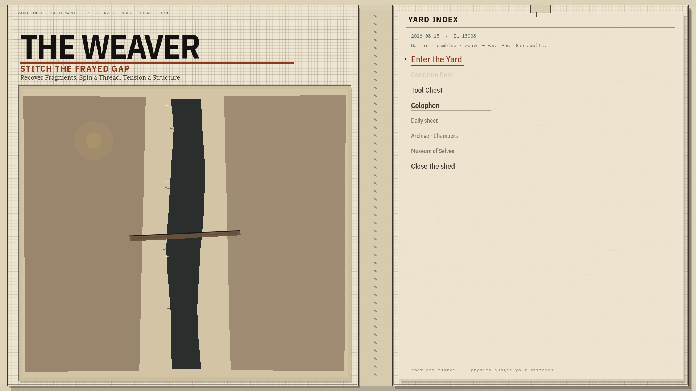
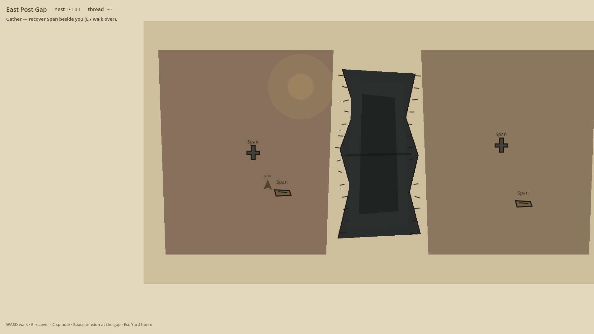
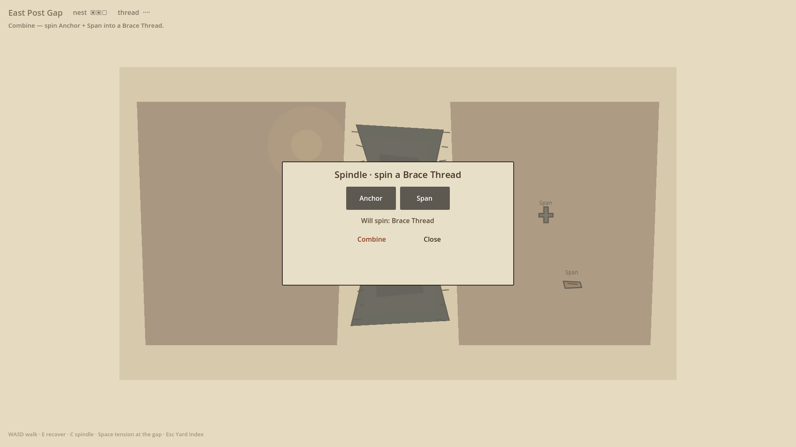
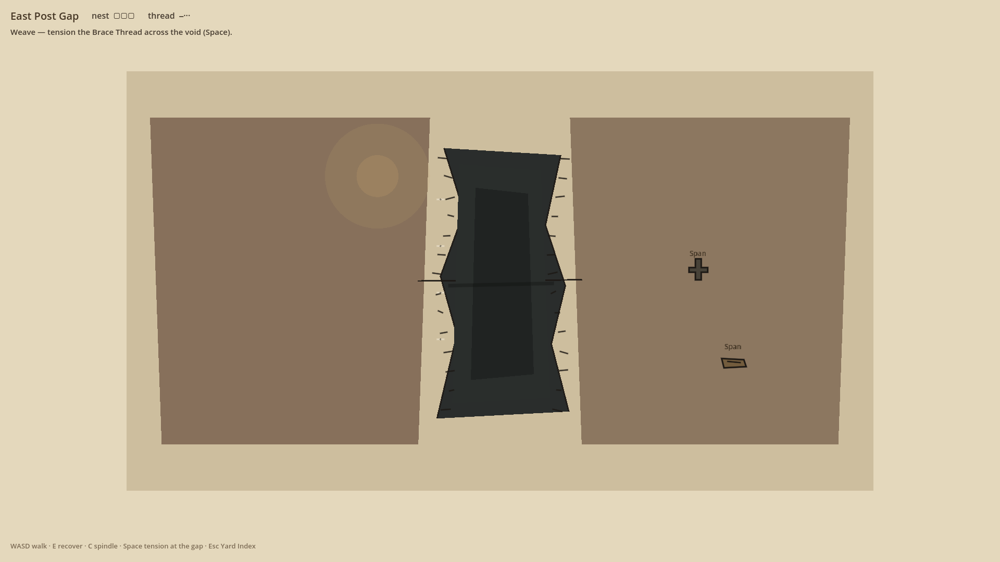
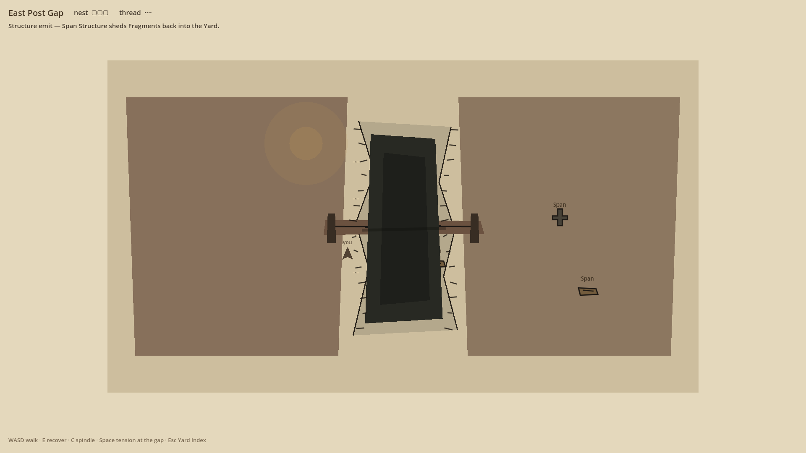
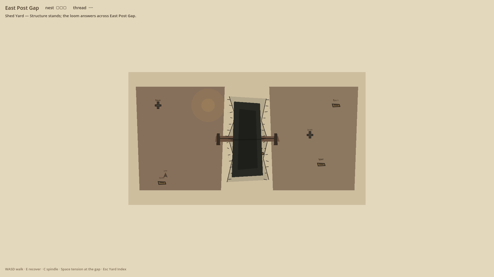

# The Weaver — visual lock photos (v2)

**Branch:** [`cursor/weaver-visual-lock`](https://github.com/cmp07/Game-/tree/cursor/weaver-visual-lock)  
**What this is:** live Godot 4.3 captures of the **Yard Folio** menu and **torn-gap** East Post Gap field.  
**What this is not:** Echo Lattice chamber stills, and not the older `docs/WEAVER/media/photos/` pack (left page still showed a maze film plate).

Raw base:

`https://raw.githubusercontent.com/cmp07/Game-/cursor/weaver-visual-lock/docs/WEAVER/media/photos_v2/`

---

## Photo pack (`docs/WEAVER/media/photos_v2/`)

1920×1080 PNGs from `--weaver-photos` on `game/echo_lattice`.

| # | Beat | File |
|---|---|---|
| 01 | Yard Folio menu (Enter the Yard) | [`01_menu.png`](media/photos_v2/01_menu.png) · [`01_menu_yard_enter.png`](media/photos_v2/01_menu_yard_enter.png) |
| 02 | Gather | [`02_gather.png`](media/photos_v2/02_gather.png) |
| 03 | Combine (Spindle) | [`03_combine.png`](media/photos_v2/03_combine.png) |
| 04 | Weave | [`04_weave.png`](media/photos_v2/04_weave.png) |
| 05 | Structure emit | [`05_structure.png`](media/photos_v2/05_structure.png) · [`05_structure_emit.png`](media/photos_v2/05_structure_emit.png) |
| 06 | Wider yard | [`06_wider_yard.png`](media/photos_v2/06_wider_yard.png) |

### Embeds













---

## Recapture (one Godot instance)

Requires **Godot 4.3** stable. Project path is `game/echo_lattice` (The Weaver hosted on Lattice).

```text
godot --path game/echo_lattice
```

Photo driver (writes under the project tree, then copy into this pack):

```text
godot --path game/echo_lattice --resolution 1920x1080 -- --weaver-photos --out ".capture_staging/weaver_photos"
```

Then copy staging into `docs/WEAVER/media/photos_v2/` (keep both short names and capture-script names):

- `01_menu_yard_enter.png` → `01_menu.png` and `01_menu_yard_enter.png`
- `02_gather.png` / `03_combine.png` / `04_weave.png` / `06_wider_yard.png`
- `05_structure_emit.png` → `05_structure.png` and `05_structure_emit.png`

Linux helper (xvfb): `./game/echo_lattice/tools/capture_weaver_photos.sh`  
That script still promotes into `docs/WEAVER/media/photos/` (v1). For v2, copy the staged files into `photos_v2/` as above.

If fonts fail to load, import once then recapture (still one instance at a time):

```text
godot --path game/echo_lattice --headless --import
godot --path game/echo_lattice --resolution 1920x1080 -- --weaver-photos --out ".capture_staging/weaver_photos"
```

Older gallery: [`VIEW_SCREENSHOTS.md`](VIEW_SCREENSHOTS.md) (`media/photos/` — pre visual-lock).
