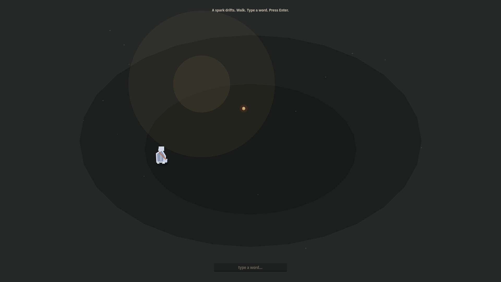
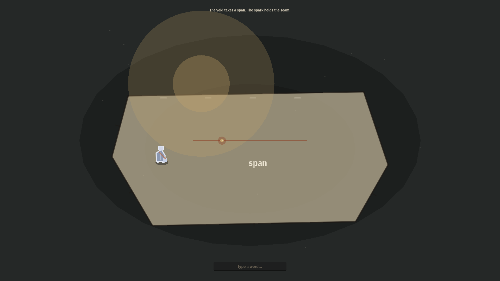
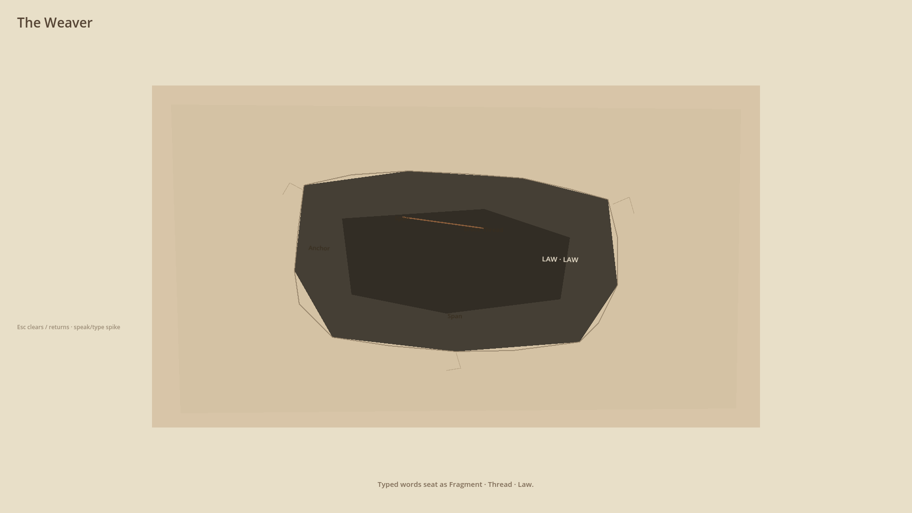

# The Weaver — VOID era photos (current north)

**Branch:** [`cursor/weaver-generative-north`](https://github.com/cmp07/Game-/tree/cursor/weaver-generative-north)  
**What this is:** live Godot 4.3 + xvfb captures of the **VOID** first minutes — black void, one spark, type-to-answer on Lattice, plus speak/type matter seating on the standalone spike.  
**What this is not:** the Yard Folio / East Post Gap **shed** pack in [`media/photos_v2/`](media/photos_v2/). Those stills are **history** (visual-lock shed era). Do not treat `photos_v2` as the live north.

| Pack | Era | Role |
|---|---|---|
| [`media/photos_v2/`](media/photos_v2/) | Old shed | Yard Folio menu + torn-gap field beats — **historical only** |
| [`media/photos_void/`](media/photos_void/) | Current north | VOID boot + seated speak/type — **authoritative visual proof** |

Raw base:

`https://raw.githubusercontent.com/cmp07/Game-/cursor/weaver-generative-north/docs/WEAVER/media/photos_void/`

---

## Photo pack (`docs/WEAVER/media/photos_void/`)

1920×1080 PNGs from `--void-photos` on `game/echo_lattice` and `--void-speak-selftest --screenshot` on `game/weaver`.

| # | Beat | Source | File |
|---|---|---|---|
| 01 | Black void (cold boot) | `game/echo_lattice` `void_boot` | [`01_void_black.png`](media/photos_void/01_void_black.png) |
| 02 | One spark drifts | `game/echo_lattice` `void_boot` | [`02_void_spark.png`](media/photos_void/02_void_spark.png) |
| 03 | After typing (`span`) | `game/echo_lattice` `void_boot` | [`03_void_after_type.png`](media/photos_void/03_void_after_type.png) |
| 04 | Typed words seated as matter | `game/weaver` `void_speak` | [`04_void_speak_seated.png`](media/photos_void/04_void_speak_seated.png) |

### Embeds








---

## Recapture (Godot 4.3 + xvfb)

```bash
export PATH="$HOME/bin:$PATH"   # Godot 4.3 stable as `godot`
GODOT=/path/to/Godot_v4.3-stable_linux.x86_64 \
  ./game/echo_lattice/tools/capture_void_photos.sh
```

That script stages under each project’s `.capture_staging/photos_void/`, then copies into `docs/WEAVER/media/photos_void/`. It **never** writes `photos_v2/`.

Manual (one instance at a time):

```text
godot --path game/echo_lattice --resolution 1920x1080 -- --void-photos --out ".capture_staging/photos_void"
godot --path game/weaver --resolution 1920x1080 -- --void-speak-selftest --screenshot --out ".capture_staging/photos_void"
```

Older shed gallery (do not use as north): [`VIEW_PHOTOS_V2.md`](VIEW_PHOTOS_V2.md).
