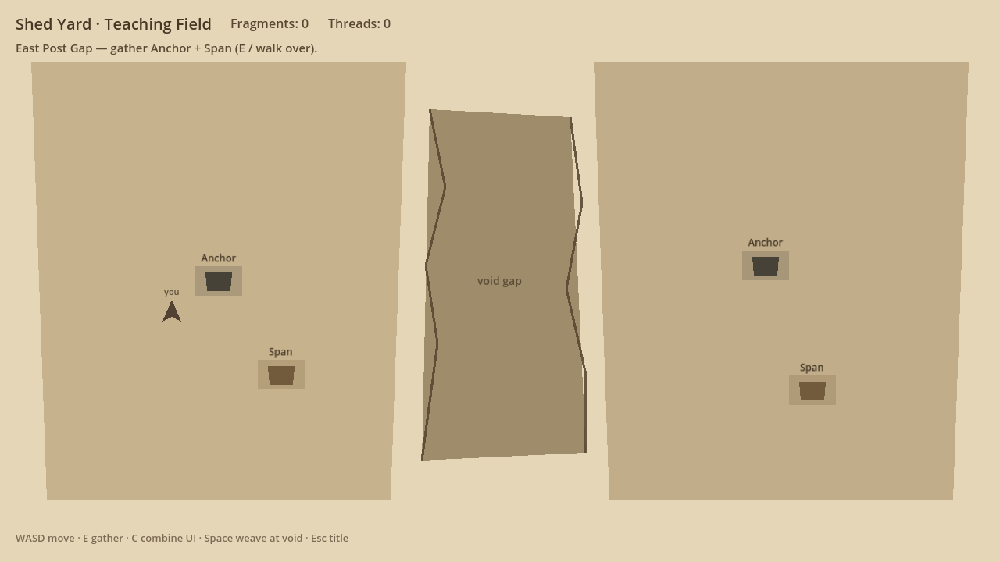
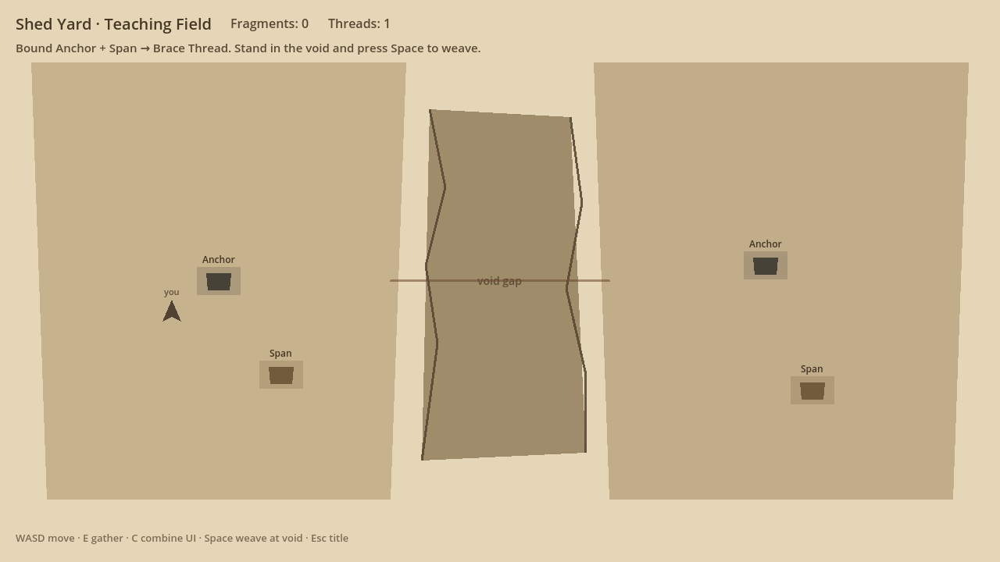
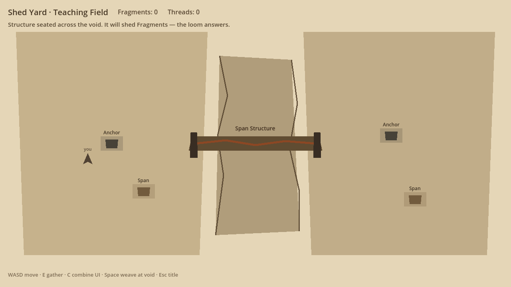

# The Weaver — prototype screenshot gallery

Live captures from `game/weaver/` (Godot 4.3 · Shed Yard teaching field).  
Loop beats: **gather → combine → weave**.

Regenerate:

```bash
xvfb-run -a godot --path game/weaver -- --selftest --screenshot
```

Canonical tip after merge: `cursor/echo-lattice-rc1`.  
This PR branch (viewable now): `cursor/weaver-screenshots-show`.

---

## 1 — Void field (gather)

East Post Gap open. Anchor + Span Fragments on both banks. HUD prompts gather.



- RC1 blob: https://github.com/cmp07/Game-/blob/cursor/echo-lattice-rc1/docs/WEAVER/screenshots/01_void_field.png
- RC1 raw: https://raw.githubusercontent.com/cmp07/Game-/cursor/echo-lattice-rc1/docs/WEAVER/screenshots/01_void_field.png
- PR blob: https://github.com/cmp07/Game-/blob/cursor/weaver-screenshots-show/docs/WEAVER/screenshots/01_void_field.png
- PR raw: https://raw.githubusercontent.com/cmp07/Game-/cursor/weaver-screenshots-show/docs/WEAVER/screenshots/01_void_field.png

---

## 2 — Thread ready (combine)

Anchor + Span bound into a Brace Thread (`Threads: 1`). Thin provisional span across the void; Space to weave.



- RC1 blob: https://github.com/cmp07/Game-/blob/cursor/echo-lattice-rc1/docs/WEAVER/screenshots/02_thread_ready.png
- RC1 raw: https://raw.githubusercontent.com/cmp07/Game-/cursor/echo-lattice-rc1/docs/WEAVER/screenshots/02_thread_ready.png
- PR blob: https://github.com/cmp07/Game-/blob/cursor/weaver-screenshots-show/docs/WEAVER/screenshots/02_thread_ready.png
- PR raw: https://raw.githubusercontent.com/cmp07/Game-/cursor/weaver-screenshots-show/docs/WEAVER/screenshots/02_thread_ready.png

---

## 3 — Structure standing (weave)

Span Structure seated across the void. Loom answers; Structure will shed Fragments.



- RC1 blob: https://github.com/cmp07/Game-/blob/cursor/echo-lattice-rc1/docs/WEAVER/screenshots/03_structure_standing.png
- RC1 raw: https://raw.githubusercontent.com/cmp07/Game-/cursor/echo-lattice-rc1/docs/WEAVER/screenshots/03_structure_standing.png
- PR blob: https://github.com/cmp07/Game-/blob/cursor/weaver-screenshots-show/docs/WEAVER/screenshots/03_structure_standing.png
- PR raw: https://raw.githubusercontent.com/cmp07/Game-/cursor/weaver-screenshots-show/docs/WEAVER/screenshots/03_structure_standing.png

---

## File index

| File | Beat | Size |
|---|---|---|
| [`screenshots/01_void_field.png`](screenshots/01_void_field.png) | Gather / open void | 1280×720 |
| [`screenshots/02_thread_ready.png`](screenshots/02_thread_ready.png) | Combine → Brace Thread | 1280×720 |
| [`screenshots/03_structure_standing.png`](screenshots/03_structure_standing.png) | Weave → Structure seated | 1280×720 |

Capture notes: [`screenshots/README.md`](screenshots/README.md)
