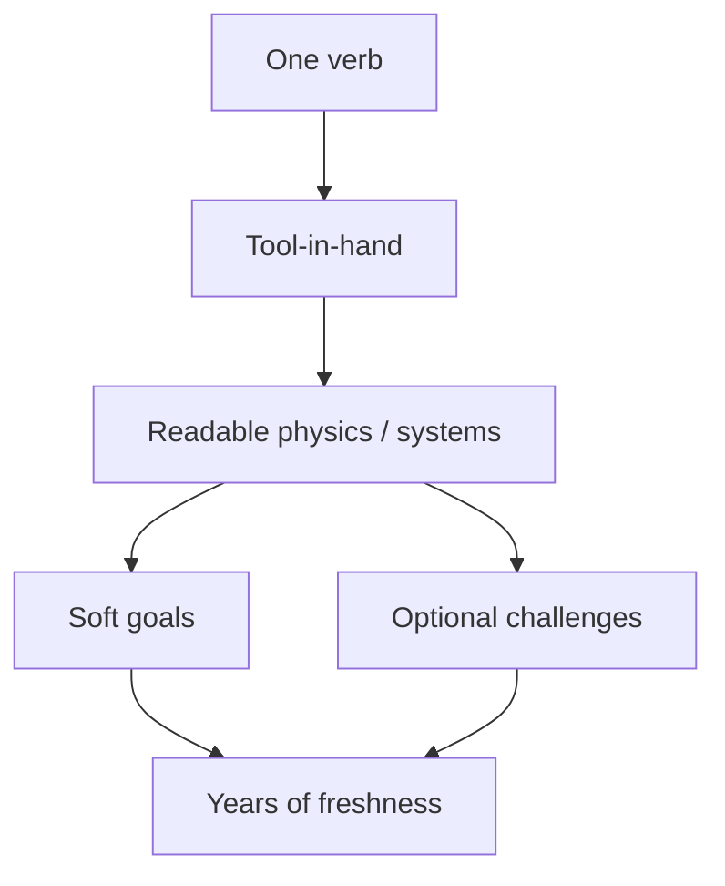

# Easy to Start, Deep to Master, Fresh for Years

**Repo:** [cmp07/Game-](https://github.com/cmp07/Game-)  
**Compiled:** August 2026  
**Mission:** Design patterns that make games **trivial to begin**, **deep to master**, and **still interesting years later** — with commercial cases across dimensions.  
**Lens:** Pattern literacy for this repo’s pure-category Steam plan ($0.99–$10, solo/small team). Not a mashup pitch list.

**Companions**

| Doc / PR | Overlap / difference |
|---|---|
| [`CATEGORY_RANKING.md`](CATEGORY_RANKING.md) · [`GAME_PLAN.md`](../GAME_PLAN.md) | Product sequence constraints (this branch) |
| [PR #17 — Simple/deep inventive games](https://github.com/cmp07/Game-/pull/17) | Market reality + ranked $3–$10 templates |
| [PR #8 — Physics-forward Steam](https://github.com/cmp07/Game-/pull/8) | Physics as verb vs gimmick |
| [PR #18 — Outside-the-box indies](https://github.com/cmp07/Game-/pull/18) | Weird single-hook Steam wins 2022–2026 |
| [PR #12 — Creation genres](https://github.com/cmp07/Game-/pull/12) | Build-from-nothing pure genres |

This report is the **longevity / mastery pattern** layer: *why* some simple games stay fresh, not which Steam price band to ship first.

---

## 1. Executive verdict

Games that stay fun for years almost never win by adding more verbs, menus, or content mountains. They win by **compressing input** and **expanding consequence**.

Five recurring patterns show up across abstracts, AAA open worlds, physics toys, and $5 Steam breakouts:

| Pattern | One-line job | Longevity engine |
|---|---|---|
| **One verb** | Teach a single primary action | Nuance + situational reuse instead of verb checklist |
| **Tool-in-hand** | Put a portable capability into the world | Same tool × new materials / contexts forever |
| **Readable physics** | World rules that players can predict and exploit | Mental models compound; failure teaches |
| **Soft goals** | Success is player-defined / satisficed | No “finished the content” cliff |
| **Sandbox + optional challenges** | Free play first; authored pressure opt-in | Sandbox for invention; challenges for mastery ladder |

**Commercial translation for this repo:** Prefer products where the store page sells **one verb** and the first minute proves it, then let depth come from **side-effects, trade-offs, and optional pressure** — not from feature soup. That matches the hard rule in [`GAME_PLAN.md`](../GAME_PLAN.md): one pure category per Steam page.

**Anti-pattern:** “Easy to learn, hard to master” as a vague pitch is useless for feature decisions ([Dan Felder on mission/boundary goals](https://danfelder.net/2026/05/15/using-the-mission-boundary-goal-framework/)). Use it as a **ratio test**: *Does this change minimize new learning while maximizing new interesting situations?* ([Marcin Jóźwik / Game Developer](https://www.gamedeveloper.com/design/what-makes-games-easy-to-learn-and-hard-to-master)).

---

## 2. What “fresh for years” actually means

Longevity is not the same as content volume or live-ops cadence. Across long-lived hits, freshness comes from at least one of:

1. **Combinatorial space** — new situations from old pieces (Go, Spelunky, Balatro jokers).  
2. **Skill ceiling** — the same level still rewards finer control (Getting Over It, Tetris, fighting games).  
3. **Authorship / soft goals** — players invent projects the designer never scheduled (Minecraft, Besiege sandbox, Animal Crossing).  
4. **Social / comparative loops** — dailies, seeds, leaderboards, shared clips (Spelunky daily, Vampire Survivors builds, Teardown Workshop).  
5. **System literacy** — dying/failing teaches a rule you keep for life (Spelunky traps, Noita materials, Teardown structural shortcuts).

If a design only delivers (4) without (1)–(3), freshness dies when the clip meta moves on. If it only delivers content dumps without a compounding model, freshness dies when the checklist ends.

---

## 3. Pattern catalog

### 3.1 One verb

**Definition:** The player’s primary agency collapses to **one nameable action** (place, move, grab, connect, drop, swing). Secondary inputs exist only to serve that verb’s nuance.

**Why easy start:** One sentence of rules; demo/GIF works.  
**Why deep mastery:** Depth comes from *when/where/how hard* you use the verb, not from unlocking a second verb.  
**Why years later:** Community vocabulary grows around techniques inside the verb (routes, timings, builds, shapes).

**Design levers**

| Lever | Effect |
|---|---|
| Continuous control resolution | Mouse hammer / aim / drop angle → skill ceiling ([Game Design Skills on depth](https://gamedesignskills.com/game-design/game-depth/)) |
| Situational reuse | Same action useful for movement, combat, puzzle, traversal |
| Trade-offs on every use | Resource, position, or risk cost prevents dominant spam ([Sid Meier: interesting decisions](https://www.gamedeveloper.com/design/gdc-2012-sid-meier-on-how-to-see-games-as-sets-of-interesting-decisions)) |
| Combo / sequence value | Chains worth more than sum of parts ([Jóźwik](https://www.gamedeveloper.com/design/what-makes-games-easy-to-learn-and-hard-to-master)) |

**Commercial cases (by dimension)**

| Dimension | Title | Verb | Notes |
|---|---|---|---|
| Abstract / timeless | **Go** | Place stone | Rules learnable quickly; ~2.1×10¹⁷⁰ positions; continuously played for 2,500+ years ([Wikipedia: Go](https://en.wikipedia.org/wiki/Go_(game))) |
| Abstract / digital | **Tetris** lineage | Rotate/place piece | Decades of competitive mastery from one placement verb |
| Physics skill | **Getting Over It** | Swing hammer | ~$7.99; one mouse axis; clip economy + infinite retries ([Steam](https://store.steampowered.com/app/240720/Getting_Over_It_with_Bennett_Foddy/)) |
| Puzzle stealth | **Gunpoint** | Crosslink / connect | One rewiring verb → combinatorial room solutions ([Puzzlebyrinth](https://puzzlebyrinth.com/en/reviews/gunpoint)) |
| Spatial puzzle | **Portal** | Shoot portal | Verb is spatial authorship; levels teach uses, not new guns ([Thompson on Portal’s verb](http://tevisthompson.com/portal-2-and-point-of-view/)) |
| Action roguelite | **Vampire Survivors** | Move (weapons autofire) | ~$4.99 smash; casino-grade feedback on a one-hand verb ([The Verge](https://www.theverge.com/2022/2/19/22941145/vampire-survivors-early-access-steam-pc-mac-luca-galante); [Guardian](https://www.theguardian.com/games/2023/aug/04/baftas-video-game-vampire-survivors-luca-galante)) |
| Card / scoring | **Balatro** | Play poker hand | Familiar verb + broken scoring → years of build discourse (prestige price; craft reference) |
| Arcade machine | **Coin pusher** comps | Drop coin | Readable greed physics; “one more drop” ([The Coin Game](https://store.steampowered.com/app/598980/The_Coin_Game/), [RACCOIN](https://store.steampowered.com/app/3784030/RACCOIN_Coin_Pusher_Roguelike/)) |

**Solo feasibility:** Highest pattern leverage for $0.99–$10. One verb is also the marketing unit.

---

### 3.2 Tool-in-hand

**Definition:** The player carries a **portable capability** that rewrites interactions with whatever it touches. Depth = tool × world materials × player intent — not a larger inventory of unrelated gadgets.

**Why easy start:** Hold tool → try it on nearest object → immediate feedback.  
**Why deep mastery:** Expert play is knowing *which* material/context makes the tool sing.  
**Why years later:** New objects/mods/levels multiply the same tool without teaching new verbs.

**Canonical shape (Nintendo):** Breath of the Wild / Tears of the Kingdom give a small set of tools (magnesis, stasis, cryonis, bombs → Ultrahand / Fuse / Recall) and a **physics + chemistry** world that multiplies them. Fujibayashi’s GDC thesis: multiplicative gameplay mass-produces puzzles without scripting each solution ([The Verge interview](https://www.theverge.com/2017/3/11/14881076/the-legend-of-zelda-breath-of-the-wild-nintendo-interview); [Game Developer](https://www.gamedeveloper.com/design/forging-i-zelda-i-s-future-by-revisiting-its-past); [Thumbsticks chemistry writeup](https://www.thumbsticks.com/gdc-17-breath-of-the-wild-science-lies/)). TotK’s Ultrahand was explicitly simplified toward “keep it simple” while still causing daily physics chaos in production ([TheGamer / GDC](https://www.thegamer.com/the-legend-of-zelda-tears-of-the-kingdom-ultrahand-caused-chaos-in-development/)).

**Indie / Steam-scale cousins**

| Title | Tool | World that multiplies it |
|---|---|---|
| **Noita** | Modular wand | Every pixel is a material; spells rewrite terrain/enemies ([Noita site](https://noitagame.com/); [IGF Road to Noita](https://www.gamedeveloper.com/game-platforms/road-to-the-igf-nolla-games-i-noita-i-)) |
| **Portal** | Portal gun | Surfaces + momentum conservation |
| **Teardown** | Guns / bombs / tools | Fully destructible voxels; tools create shortcuts ([Gustafsson design notes via PC Gamer](https://www.pcgamer.com/teardown-dev-on-the-frustrating-experience-of-developing-the-breakout-hit/)) |
| **Besiege** | Build blocks as “tools” | Physics joints + destruction objectives |
| **Opus Magnum**-class | Arm / glyph tools | Atomic ops compose machines |

**Design tests**

1. Can a new player invent a useful use of the tool in 60 seconds without a tutorial paragraph?  
2. Can a veteran invent a use the designer never scripted?  
3. Does adding a new *material* create more depth than adding a new *tool*? (Prefer materials.)

**Solo warning:** TotK / Noita-scale tool×world matrices are career engines. For a first Steam ship, shrink the world: **one tool, one material family, authored arenas** (see coin-machine / tension vignette lanes in the plan).

---

### 3.3 Readable physics

**Definition:** Simulation rules are **legible, consistent, and causal**. Players can form a mental model; failure points to a wrong belief about the world, not to RNG fog or invisible glue.

**Why easy start:** Real-world analogies (fire burns, sand piles, beams snap, coins shove coins).  
**Why deep mastery:** Experts exploit second-order effects (chain reactions, structural weak points, material combos).  
**Why years later:** The world remains a laboratory; new challenges reuse the same physics literacy.

**Readable vs spectacular**

| Readable (keeps mastery fun) | Spectacular-only (novelty dies) |
|---|---|
| Same material → same behavior everywhere | Pre-fractured props, same break every time |
| Failure shows *where* you were wrong | Chaos without authorship |
| Physics necessary for the win | Trailer debris that doesn’t change decisions |
| Reset → retry in seconds | Long load / lost progress for noise deaths |

Sibling research spells this out for Steam physics products: [PR #8 — Physics-forward Steam](https://github.com/cmp07/Game-/pull/8).

**Commercial cases**

| Title | Readable model | Longevity signal |
|---|---|---|
| **Teardown** | Voxel volume integrity + destruction as shortcut crafting | Campaign + sandbox + massive Workshop ([Game Developer](https://www.gamedeveloper.com/design/combining-bombastic-heists-with-a-fully-destructible-voxel-world-in-i-teardown-i-); [Coffee Stain overview](https://coffeestain.com/game/teardown/)) |
| **Besiege** | Blocks, joints, stress | Years of machines / Workshop ([Steam](https://store.steampowered.com/app/346010/Besiege/)) |
| **Noita** | Materials + reactions + wand programming | Secret hunting and wand tech after credits |
| **Spelunky** | Object/monster personalities compose | Systemic fairness makes death a teacher ([Yu / Game Developer](https://www.gamedeveloper.com/design/how-i-spelunky-i-s-designer-set-out-to-create-complexity-with-simplicity); [Birdor case study](https://blog.birdor.com/spelunky-freeware-to-commercial-product-case-study/)) |
| **BotW chemistry** | Elements × materials × states | Shrines/world as generative puzzle factory ([Thumbsticks](https://www.thumbsticks.com/gdc-17-breath-of-the-wild-science-lies/)) |
| **Getting Over It** | Continuous rigid-body climbing | Skill ceiling is the content |
| **The Coin Game / RACCOIN** | Coins, weight, pusher shelf | Arcade greed readability |

**Key Teardown lesson (sandbox tension):** Total destruction freedom breaks traditional gating. Gustafsson’s fix was **not** starving the player of tools; it was **structure**: open map + planning phase + timed execution, so creativity has a scoreboard without fake walls ([Game Developer interview](https://www.gamedeveloper.com/design/combining-bombastic-heists-with-a-fully-destructible-voxel-world-in-i-teardown-i-); [Tuxedo Labs design notes](http://blog.tuxedolabs.com/2020/11/05/teardown-design-notes.html)).

---

### 3.4 Soft goals

**Definition:** Goals that are **satisficed rather than binary-cleared** — progress is “enough for me,” not “quest flag 47/47.” Borrowed from requirements theory (soft goals lack clear-cut satisfaction criteria; they are *satisficed* when evidence feels sufficient) ([Wikipedia: Soft goal](https://en.wikipedia.org/wiki/Soft_goal); [S-Cube](https://s-cube-network.eu/km/terms/s/soft-goal/index.html)) and applied in cozy / sandbox design as voluntary, non-coercive activity ([Project Horseshoe 2017 — Coziness](https://www.projecthorseshoe.com/reports/featured/Project_Horseshoe_2017_report_section_3.pdf)).

**Why easy start:** No fail state or tutorial gauntlet required to “play correctly.”  
**Why deep mastery:** Experts invent hard personal goals (speed, aesthetics, constraints, challenges).  
**Why years later:** The game never declares you’re done; the player’s taste keeps regenerating goals.

**Hard vs soft (design)**

| Hard goal | Soft goal |
|---|---|
| Defeat the boss / clear the act | Make a base that feels like home |
| Beat the par time | Explore until curious is satisfied |
| Unlock all nodes | Try a silly build / decorate / experiment |
| Mandatory checklist | Opt-in achievement tree as *suggestion* |

Minecraft’s philosophy is the commercial megacase: sandbox first; adventure/RPG/engineering appetites diverge; achievements were considered as **gentle guides**, not a heavy tutorial that stifles creativity ([Kotaku on achievements](https://kotaku.com/minecrafts-creator-ponders-adding-achievements-5771218); [Game Developer / Bergensten on sandbox divergence](https://www.gamedeveloper.com/business/talking-the-future-of-i-minecraft-i-); [Den of Geek / Notch](https://www.denofgeek.com/games/an-interview-with-minecraft-creator-markus-notch-persson/)).

Animal Crossing and Stardew show the cozy end of the same pattern: many activities can be ignored with no punishment ([Project Horseshoe](https://www.projecthorseshoe.com/reports/featured/Project_Horseshoe_2017_report_section_3.pdf)).

Derek Yu’s “spiky vs soft” framing is useful here: Spelunky is spiky (world exists without you; consequences bite), yet still teaches systemic literacy; Animal Crossing can be soft while still feeling like a place to live rather than a min-max spreadsheet ([PC Gamer / Yu](https://www.pcgamer.com/playing-difficult-games-is-like-eating-spicy-food-says-spelunky-creator/)). Soft *goals* can exist inside spiky *worlds* (daily challenge as optional; base camp as soft progress in Spelunky 2).

**Commercial cases**

| Dimension | Title | Soft-goal flavor |
|---|---|---|
| Sandbox megahit | **Minecraft** | Build / survive / redstone / adventure — player picks |
| Cozy life sim | **Animal Crossing** | Island taste; no antagonist urgency |
| Farm / life | **Stardew Valley** | Community center is optional pressure nested in soft life |
| Physics toy | **Besiege sandbox** | Build for delight; campaign optional |
| Destruction toy | **Teardown sandbox** | Demolish without heist timer |
| Idle / numbers | **Particul-like** | Soft optimization goals; watch piles grow |
| Collection roguelite | **Vampire Survivors** | “One more unlock / build” as soft meta goals |

**Solo warning:** Soft goals without a crisp verb become “asset browser.” Soft goals work when the **toy is already fun** for five minutes with no quest text.

---

### 3.5 Sandbox + optional challenges

**Definition:** Default mode is **open play** (low coercion). **Challenges** (campaigns, dailies, modifiers, leaderboards, shrines, contracts) are a mastery ladder players can climb when they want pressure.

**Why easy start:** Enter → poke systems → dopamine without syllabus.  
| Why deep mastery: Challenges constrain the toy into hard problems.  
**Why years later:** Sandbox regenerates goals; challenge packs / Workshop / seeds regenerate tests.

**Structural recipe (seen repeatedly)**

```
Toy (readable rules)
  → Sandbox (authorship, soft goals)
  → Optional challenges (constraints, timers, seeds, modifiers)
  → Social layer (Workshop, dailies, clips, ghost scores)
```

**Commercial cases**

| Title | Sandbox layer | Optional challenge layer |
|---|---|---|
| **Teardown** | Free sandbox / creative destruction | Timed heist campaign; mods with alternate rules |
| **Besiege** | Sandbox levels | 55-level campaign; multiplayer modes |
| **Minecraft** | Creative / Survival as player-set | Achievements, adventure maps, community challenges |
| **BotW / TotK** | Open Hyrule | Shrines, Divine Beasts / dungeons as optional structure |
| **Spelunky** | Runs as systemic sandbox | Daily challenge (same seed → social compare) |
| **Noita** | Wand/world lab | Parallel worlds, gods, no-hit culture (player-authored) |
| **Vampire Survivors** | Build sandbox via movement | Unlock checklist, DLC stages, challenge runs |
| **Coin / arcade toys** | Free play / relax mode | Score attacks, roguelike runs (RACCOIN) |

Gustafsson’s Teardown notes are the clearest articulation of why this split exists: destruction freedom kills door-and-key design; planning sandbox + execution pressure restores challenge without fake walls ([design notes](http://blog.tuxedolabs.com/2020/11/05/teardown-design-notes.html)).

---

## 4. How the five patterns compose

They are not five competing genres. Longevity products usually stack **2–4**:



| Stack | Example | Feel |
|---|---|---|
| Verb + physics | Getting Over It | Pure skill mountain |
| Verb + soft goals + sandbox | Minecraft (break/place) | Infinite authorship |
| Tool + readable physics + challenges | BotW / Teardown | Creative problem-solving |
| Verb + combo modularity + soft meta | Vampire Survivors / Balatro | “One more run” for years |
| Systemic pieces + death-as-teacher + daily | Spelunky | Literacy forever |

**Elegant design checklist** (compressing Jóźwik + Meier + Felder):

1. **Inherent simplicity** — few visible rules; hide engine complexity.  
2. **Coherence** — rules analogize to prior experience (fire, weight, poker hands).  
3. **Progressive reveal** — teach uses of the *same* verb in new contexts (Miyamoto “rule of threes” priming) ([Game Developer](https://www.gamedeveloper.com/design/practical-game-design-the-rule-of-threes)).  
4. **Multi-purpose systems** — one action, many contexts.  
5. **Trade-offs** — no free dominant move.  
6. **Modularity** — new content as new *pieces*, not new *verbs*.  
7. **Mission/boundary clarity** — e.g. mission = maximize strategic depth; boundary = learnable in 15 minutes ([Felder](https://danfelder.net/2026/05/15/using-the-mission-boundary-goal-framework/)).

---

## 5. Commercial cases across dimensions (matrix)

Scores are qualitative **pattern fit** for longevity (not sales rank). ●●● = canonical; ●● = strong; ● = partial.

| Dimension | Exemplar | One verb | Tool-in-hand | Readable physics | Soft goals | Sandbox+challenges | Longevity note |
|---|---|---|---|---|---|---|---|
| Timeless abstract | Go / Chess | ●●● | — | Rules-as-physics | ● | Handicap / problems | Centuries |
| Skill physics | Getting Over It | ●●● | Hammer-as-tool ●● | ●●● | — | Ghost/community ● | Clip + ceiling |
| Destructible puzzle | Teardown | Shoot/break ●● | Tools ●●● | ●●● | Sandbox ●●● | Campaign ●●● | Workshop years |
| Build physics | Besiege | Build ●● | Blocks-as-tools ●●● | ●●● | ●●● | ●●● | Machine culture |
| Systemic roguelike | Spelunky | Move/whip ●● | Items ●● | Systemic ●●● | Soft meta ● | Daily ●●● | Literacy forever |
| Pixel sim roguelite | Noita | Dig/shoot ●● | Wand ●●● | ●●● | Secrets ●● | Player challenges ●●● | Post-game lab |
| Open-air adventure | BotW / TotK | Climb/run ●● | Runes/Ultrahand ●●● | Chem/physics ●●● | ●●● | Shrines ●●● | Replay invention |
| Creative sandbox | Minecraft | Break/place ●●● | Tools ●● | Block rules ●● | ●●● | ●●● | Decade+ platform |
| Cozy life | Animal Crossing | Talk/place ●● | Tools ● | Light systems ● | ●●● | Events ●● | Seasonal return |
| Autobattler lite | Vampire Survivors | Move ●●● | Weapons-as-mods ●● | Readable chaos ●● | Unlocks ●●● | Challenges ●● | Content+builds |
| Scoring invention | Balatro | Play hand ●●● | Jokers-as-tools ●●● | Math readable ●●● | Soft climb ●● | Challenges/stakes ●● | Build discourse |
| Tension vignette | Buckshot Roulette | Pull trigger ●●● | Items ●● | Stakes readable ●● | — | Modifiers ●● | Clip replay |
| Arcade coin | Coin Game / RACCOIN | Drop ●●● | Machines ●● | ●●● | Relax mode ●● | Score/roguelike ●● | “One more” |
| Idle particle | Particul-like | Click/claim ●● | Extractors ● | Spectacle ● | ●●● | Prestige ●● | Catalog hours |

---

## 6. Implications for this repo (pure categories, $0.99–$10)

Map patterns → planned products without mashups:

### Game 1 — Tension / horror vignette (recommended first)

| Pattern | How to use |
|---|---|
| One verb | The stakes action (draw, pull, commit) must be the trailer. |
| Tool-in-hand | At most **one** inventory language of modifiers — not a loadout RPG. |
| Readable physics / rules | Outcomes must be explainable after failure (fair cruelty). |
| Soft goals | Weak here; vignettes are usually hard-goal. Compensate with **modifiers / challenge modes** for longevity. |
| Sandbox+challenges | “Sandbox” = short private lab of rules; ship challenge seeds / daily modifiers early. |

Buckshot-class products prove clip longevity; they do **not** automatically have decade-long soft-goal longevity unless you add modular pressure.

### Game 2 — Coin-machine

| Pattern | How to use |
|---|---|
| One verb | Drop / nudge. |
| Readable physics | Shelf weight, coin size, payout geometry — the whole product. |
| Soft goals | Relax mode, collection aesthetics. |
| Sandbox+challenges | Free play + score attacks / roguelike runs (RACCOIN lesson: progression wrappers work if physics stays the star). |

### Game 3 — Idle / particle tycoon

| Pattern | How to use |
|---|---|
| One verb | Claim / route / automate. |
| Soft goals | Primary longevity engine (numbers + prestige). |
| Readable physics | Only if particle behavior changes **decisions** (clogging, purity, flow). Otherwise sand is skin — see Particul lesson in physics research. |
| Challenges | Prestige constraints, challenge seeds, community goals. |

### Pattern priorities if inventing a “years later” product later

1. **Readable world model** (even if not 3D physics — card math and rule blocks count).  
2. **One verb** demos in 15 seconds.  
3. **Optional challenges** before content mountain.  
4. **Soft goals** only after the toy is already fun.  
5. **Tool-in-hand** only if you can afford a material set that multiplies it.

---

## 7. Failure modes (why “simple” games still feel disposable)

| Failure | Symptom | Fix toward longevity |
|---|---|---|
| Verb salad | Tutorial teaches 8 actions | Cut to one verb; express variety via context |
| Hard goals only | Credits = delete install | Add sandbox, modifiers, dailies, Workshop |
| Unreadable chaos | Deaths feel random | Consistent materials; telegraph; shorter retries |
| Soft goals with no toy | “Do whatever” emptiness | Make the first minute delightful without quests |
| Content width, no depth | 50 levels of same trick | Connect systems; multi-purpose pieces ([width vs depth](https://rexcellentgames.com/width-vs-depth/)) |
| Live-ops without literacy | Daily login, no mastery | Prefer systemic novelty over calendar novelty |
| Mashup store page | Unclear fantasy | One pure category ([`GAME_PLAN.md`](../GAME_PLAN.md)) |

---

## 8. Practical checklist (ship-facing)

Use when evaluating a prototype:

**Start (first 60 seconds)**

- [ ] Can a stranger name the verb after watching a silent GIF?  
- [ ] Does the first success/fail explain itself without text?  
- [ ] Is there at most one primary control scheme?

**Mastery (hours 2–20)**

- [ ] Are there trade-offs on the core action?  
- [ ] Do pieces combine into non-obvious strategies?  
- [ ] Does failure teach a reusable rule?  
- [ ] Is there a skill or knowledge ceiling beyond the tutorial path?

**Years (month 6+)**

- [ ] Soft goals or player authorship exist (builds, routes, machines, collections)?  
- [ ] Optional challenges / seeds / modifiers can be added without new verbs?  
- [ ] Community can invent goals you didn’t schedule?  
- [ ] New content can be **materials / constraints / arenas**, not a second genre?

**Mission / boundary example for this repo**

- Mission: Maximize interesting situations from one verb.  
- Boundary: Learnable in under 10 minutes; demoable in 30 seconds; pure category on the store page.

---

## 9. Selected sources

### Design theory

- Marcin Jóźwik — [What Makes Games Easy to Learn And Hard to Master](https://www.gamedeveloper.com/design/what-makes-games-easy-to-learn-and-hard-to-master) (Game Developer, 2023); [Part 2](https://medium.com/ironsource-levelup/what-makes-games-easy-to-learn-and-hard-to-master-part-2-423102b57cd6)
- Dan Felder — [Using the Mission/Boundary Goal Framework](https://danfelder.net/2026/05/15/using-the-mission-boundary-goal-framework/) (2026)
- Sid Meier — [GDC 2012: games as interesting decisions](https://www.gamedeveloper.com/design/gdc-2012-sid-meier-on-how-to-see-games-as-sets-of-interesting-decisions); [Designer Notes: Sid’s Rules](https://www.designer-notes.com/game-developer-column-5-sids-rules/)
- Mark Brown / practical craft — [Practical Game Design: The Rule of Threes](https://www.gamedeveloper.com/design/practical-game-design-the-rule-of-threes)
- Game Design Skills — [What is Game Depth and How to Evaluate It](https://gamedesignskills.com/game-design/game-depth/)
- Rexcellent Games — [Width vs Depth](https://rexcellentgames.com/width-vs-depth/)
- Soft goals (requirements theory) — [Wikipedia](https://en.wikipedia.org/wiki/Soft_goal); [S-Cube](https://s-cube-network.eu/km/terms/s/soft-goal/index.html)
- Project Horseshoe 2017 — [Coziness in Games (safety, abundance, softness)](https://www.projecthorseshoe.com/reports/featured/Project_Horseshoe_2017_report_section_3.pdf)

### Tool-in-hand / multiplicative worlds

- Fujibayashi / Dohta / Takizawa — BotW GDC: [Verge interview](https://www.theverge.com/2017/3/11/14881076/the-legend-of-zelda-breath-of-the-wild-nintendo-interview); [Game Developer](https://www.gamedeveloper.com/design/forging-i-zelda-i-s-future-by-revisiting-its-past); [Thumbsticks: chemistry engine](https://www.thumbsticks.com/gdc-17-breath-of-the-wild-science-lies/); [GDC Vault session](https://gdcvault.com/play/1024562/Change-and-Constant-Breaking-Conventions)
- TotK Ultrahand — [TheGamer / GDC chaos notes](https://www.thegamer.com/the-legend-of-zelda-tears-of-the-kingdom-ultrahand-caused-chaos-in-development/); [Eurogamer design feature](https://www.eurogamer.net/how-nintendo-designed-ultrahand) *(video essay coverage)*
- Noita — [Official site](https://noitagame.com/); [Road to the IGF](https://www.gamedeveloper.com/game-platforms/road-to-the-igf-nolla-games-i-noita-i-); [ResearchGate timeline study](https://www.researchgate.net/publication/383412226_Noita_A_Long_Journey_of_a_Game_Idea)

### Readable physics / sandbox + challenges

- Dennis Gustafsson — [Teardown design notes](http://blog.tuxedolabs.com/2020/11/05/teardown-design-notes.html); [Game Developer: heists + voxels](https://www.gamedeveloper.com/design/combining-bombastic-heists-with-a-fully-destructible-voxel-world-in-i-teardown-i-); [Game Developer: voxel tech](https://www.gamedeveloper.com/design/how-beautiful-voxels-laid-the-way-for-i-teardown-s-i-heist-y-framework); [PC Gamer summary](https://www.pcgamer.com/teardown-dev-on-the-frustrating-experience-of-developing-the-breakout-hit/); [Coffee Stain page](https://coffeestain.com/game/teardown/)
- Besiege — [Steam](https://store.steampowered.com/app/346010/Besiege/)
- Getting Over It — [Steam](https://store.steampowered.com/app/240720/Getting_Over_It_with_Bennett_Foddy/)

### Soft goals / sandbox authorship

- Minecraft — [Notch interview (Den of Geek)](https://www.denofgeek.com/games/an-interview-with-minecraft-creator-markus-notch-persson/); [Bergensten on sandbox divergence](https://www.gamedeveloper.com/business/talking-the-future-of-i-minecraft-i-); [Achievements as soft guides](https://kotaku.com/minecrafts-creator-ponders-adding-achievements-5771218); [GDC fireside](https://www.gamesindustry.biz/gdc-notchs-fireside-tales)
- Derek Yu — [Complexity with simplicity (Spelunky)](https://www.gamedeveloper.com/design/how-i-spelunky-i-s-designer-set-out-to-create-complexity-with-simplicity); [Spiky vs soft](https://www.pcgamer.com/playing-difficult-games-is-like-eating-spicy-food-says-spelunky-creator/); [Birdor product case study](https://blog.birdor.com/spelunky-freeware-to-commercial-product-case-study/); [RPS making-of](https://www.rockpapershotgun.com/making-of-spelunky)

### One-verb commercial smash cases

- Vampire Survivors — [The Verge (casino / one-button lessons)](https://www.theverge.com/2022/2/19/22941145/vampire-survivors-early-access-steam-pc-mac-luca-galante); [Guardian](https://www.theguardian.com/games/2023/aug/04/baftas-video-game-vampire-survivors-luca-galante); [RPS interview](https://www.rockpapershotgun.com/vampire-survivors-interview-creator-wanted-something-to-play-at-the-weekend)
- Portal verb reading — [Tevis Thompson](http://tevisthompson.com/portal-2-and-point-of-view/)
- Gunpoint one-verb critique — [Puzzlebyrinth](https://puzzlebyrinth.com/en/reviews/gunpoint)
- Go longevity / complexity — [Wikipedia](https://en.wikipedia.org/wiki/Go_(game)); [British Go Association vs Chess](https://www.britgo.org/learners/chessgo.html); [Complexity vs complication](https://www.gamedeveloper.com/design/complexity-and-complication-also-why-i-love-go-)
- Bennett Foddy on minimal mechanics — [Guardian on Flappy Bird](https://www.theguardian.com/technology/2014/feb/10/flappy-bird-is-dead-but-brilliant-mechanics-made-it-fly)

### Repo comps (Steam)

- [Buckshot Roulette](https://store.steampowered.com/app/2835570/Buckshot_Roulette/)
- [RACCOIN](https://store.steampowered.com/app/3784030/RACCOIN_Coin_Pusher_Roguelike/) · [The Coin Game](https://store.steampowered.com/app/598980/The_Coin_Game/)
- [Particul](https://store.steampowered.com/app/4273120/Particul/)
- [CloverPit](https://store.steampowered.com/app/3314790/CloverPit/) (stakes-adjacent; not a vignette mash target)

### Cloud-agent cross-links (same research wave)

- Simple/deep market templates — agent [bc-ddb6f106…](https://cursor.com/agents/bc-ddb6f106-52a1-4dee-a5cc-5bac8a296b0b) · PR #17  
- Physics-forward — [bc-7d6304c2…](https://cursor.com/agents/bc-7d6304c2-b5e2-4219-8280-33b988d476fd) · PR #8  
- Outside-the-box indies — [bc-d70d494a…](https://cursor.com/agents/bc-d70d494a-f031-4bc5-9618-626a0cfcfe90) · PR #18  
- Creation genres — [bc-e0c3e30c…](https://cursor.com/agents/bc-e0c3e30c-0560-4a7d-a4a0-1124b3bed095) · PR #12  

---

## 10. Bottom line

**Trivial start** comes from one verb, coherent analogies, and feedback that teaches without a manual.  
**Deep mastery** comes from possibility space, trade-offs, and readable systems — not from more buttons.  
**Years of freshness** comes from soft goals and/or optional challenges sitting on top of a toy that was already fun empty-handed.

For Game-’s sequence: ship **one verb people can clip**, keep the world **readable**, add **optional pressure** before content sprawl, and treat Nintendo/Noita/Teardown tool-worlds as **craft references**, not first-product scope.
